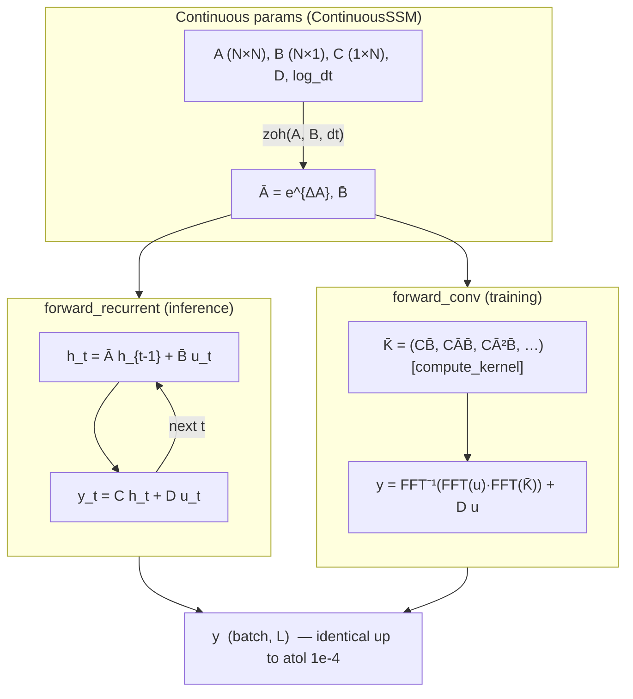

# 01 — SSM Mathematical Foundations

## Overview

A **State Space Model (SSM)** is a classical tool from control theory that
describes how a system carries information forward in time through a hidden
*state*. Modern deep-learning architectures — S4 [Gu et al., 2021], its HiPPO
initialization [Gu et al., 2020], and Mamba [Gu & Dao, 2023] — repurpose the
same linear SSM as a sequence-mixing primitive that is both *parallelizable like
a convolution* (for training) and *recurrent with constant memory* (for
inference).

This document builds the mathematics from first principles and ties every result
to the from-scratch implementation in this repository:

- `mamba/core/discretize.py` — the maps from continuous-time to discrete-time
  matrices: `zoh`, `bilinear`, `euler`, `selective_zoh`, and the helper `phi`.
- `mamba/core/ssm_base.py` — the abstract two-mode contract `SSMBase` and the
  concrete LTI model `ContinuousSSM` with its `compute_kernel`, `forward_conv`,
  and `forward_recurrent` methods.

By the end you should understand what each continuous matrix means physically,
how the discretization rules are derived, why the recurrent and convolutional
views compute *exactly* the same function, when each is cheaper, and how
stability is governed by eigenvalues — closing with a hand-worked 2×2 example you
can check against the code. The intended reader knows PyTorch and linear algebra
but is new to SSMs.

---

## Mathematical Background

### 1. Continuous-time SSMs

A linear, time-invariant (LTI) continuous SSM is the pair of equations that open
the module docstring of `mamba/core/discretize.py`:

```math
x'(t) = A\,x(t) + B\,u(t)
```

The instantaneous change of the hidden state is a linear mix of where the state
already is (`A x`) plus how the current input pushes it (`B u`).

```math
y(t) = C\,x(t) + D\,u(t)
```

The observable output is a linear readout of the hidden state (`C x`) plus a
direct, memoryless pass-through of the input (`D u`).

Each symbol has a concrete physical role:

- **State** `x(t) ∈ ℝ^N` — the system's internal memory. It is *not* directly
  observed; it is the compressed summary of all past inputs that the system needs
  to predict the future. `N` is the **state dimension** (`d_state` in
  `ContinuousSSM.__init__`).
- **State matrix** `A ∈ ℝ^{N×N}` — the *dynamics*. Its eigenvalues set how fast
  each internal mode decays or grows; it is the part of the model that says "how
  does memory evolve when left alone." In `ContinuousSSM`, `A` is initialized to
  the HiPPO-LegS matrix via `hippo_legs(d_state)` [Gu et al., 2020].
- **Input matrix** `B ∈ ℝ^{N×M}` — how a scalar/vector input is *written into*
  the state. For the SISO `ContinuousSSM`, `M = 1` and `B` is a column `(N, 1)`.
- **Output matrix** `C ∈ ℝ^{P×N}` — how the state is *read out* into the output.
  For SISO, `P = 1` and `C` is a row `(1, N)`.
- **Feedthrough** `D ∈ ℝ^{P×M}` — a skip connection from input straight to
  output, bypassing the state entirely. In `ContinuousSSM` it is a learnable
  scalar `self.D` (initialized to zero), and it appears as `+ u * self.D` in
  `forward_conv` / `forward_recurrent`.

The general solution of the state ODE (by the integrating-factor method) is

```math
x(t) = e^{A(t - t_0)}\,x(t_0) + \int_{t_0}^{t} e^{A(t - \tau)}\,B\,u(\tau)\,d\tau
```

The state at time `t` is the freely-evolved initial state plus the accumulated,
exponentially-weighted history of every past input — and evaluating this over one
step of width `Δ` is exactly what the discretization rules below do.

### 2. Discretization theory

To run on a digital computer we sample at a fixed (or, in Mamba,
input-dependent) step size `Δ` and produce the recurrence used by
`forward_recurrent`:

```math
x_k = \bar{A}\,x_{k-1} + \bar{B}\,u_k, \qquad y_k = C\,x_k + D\,u_k
```

The discrete update advances the state one tick using discrete matrices `Ā` and
`B̄`, while the readout `C, D` are unchanged. The whole job of discretization is
to compute `Ā` and `B̄` from `A`, `B`, and `Δ`.

#### 2a. Zero-Order Hold (ZOH) — `zoh(A, B, delta)`

ZOH assumes the input is *held constant*, `u(τ) = u_k`, across the interval
`[kΔ, (k+1)Δ]`. Substituting a constant `u_k` into the exact ODE solution over
one step of width `Δ` gives:

```math
\bar{A} = e^{\Delta A}, \qquad
\bar{B} = \left(\int_{0}^{\Delta} e^{\tau A}\,d\tau\right) B
```

`Ā` is the exact one-step state-transition (the matrix exponential), and `B̄` is
the exact integral of the input's effect while it is held flat — this makes ZOH
the *exact* discretization for piecewise-constant inputs.

If `A` is invertible the integral has the textbook closed form:

```math
\bar{B} = A^{-1}\big(e^{\Delta A} - I\big)B = A^{-1}(\bar{A} - I)B
```

When `A` can be inverted, the input integral collapses to this neat expression,
but it breaks down the instant `A` is singular.

**The augmented-matrix exponential trick.** The textbook formula divides by `A`
and explodes when `A` is singular (e.g. `A = 0`, a perfectly valid integrator).
`zoh()` sidesteps this entirely. Build the `(N+M)×(N+M)` block generator

```math
M = \begin{bmatrix} A & B \\ 0 & 0 \end{bmatrix}
```

This stacks `A` and `B` into one larger matrix whose bottom block is all zeros,
so that exponentiating it will "run" the dynamics on `A` and integrate `B` in a
single operation. Exponentiating the scaled generator yields both discrete
matrices in one shot:

```math
\exp(\Delta M) =
\begin{bmatrix} e^{\Delta A} & \left(\int_0^\Delta e^{\tau A}d\tau\right)B \\ 0 & I \end{bmatrix}
= \begin{bmatrix} \bar{A} & \bar{B} \\ 0 & I \end{bmatrix}
```

The top-left block of the big exponential *is* `Ā` and the top-right block *is*
`B̄`, with no matrix inverse anywhere — so the formula stays well-defined even
when `A` has zero eigenvalues.

To see *why* this works, expand the power series of `ΔM`. Because the bottom row
of `M` is zero, `M^j = [[A^j, A^{j-1}B], [0, 0]]` for `j ≥ 1`, so the top-right
block of `exp(ΔM) = Σ (ΔM)^j / j!` sums to:

```math
\sum_{j=1}^{\infty} \frac{\Delta^{j} A^{j-1}}{j!}\,B
= \left(\int_0^\Delta e^{\tau A}\,d\tau\right) B
```

The series for the top-right block is term-by-term identical to the integral
`∫₀^Δ e^{τA} dτ B`, which is why one matrix exponential delivers `B̄` exactly,
singular `A` or not.

This is how the code does it (`zoh`, `discretize.py`): it concatenates
`top = [Ac, Bc]` and a zero `bottom`, forms `M`, calls `torch.matrix_exp(d * M)`,
then slices `A_bar = expM[..., :n, :n]` and `B_bar = expM[..., :n, n:]`.
`ContinuousSSM._discretize()` calls exactly this `zoh(self.A, self.B, self.dt)`.

#### 2b. Bilinear / Tustin transform — `bilinear(A, B, delta)`

The bilinear rule applies the trapezoidal (midpoint-averaged) approximation to
the state derivative, replacing `x'` with `(x_k − x_{k-1})/Δ` and the right-hand
side with the average of its endpoints. Solving for `x_k` gives:

```math
\bar{A} = \left(I - \tfrac{\Delta}{2}A\right)^{-1}\left(I + \tfrac{\Delta}{2}A\right),
\qquad
\bar{B} = \left(I - \tfrac{\Delta}{2}A\right)^{-1}\Delta B
```

`Ā` is a "half-step forward over half-step backward" ratio that maps the stable
left-half `s`-plane exactly onto the unit disc, and `B̄` solves the same implicit
system for the input — this is what makes Tustin preserve stability for any `Δ`.

The code mirrors the formulas directly: `left = eye - half * Ac`,
`right = eye + half * Ac`, then `A_bar = torch.linalg.solve(left, right)` and
`B_bar = torch.linalg.solve(left, d * Bc)` — note it *solves* rather than
explicitly inverting, which is both faster and more numerically stable.

#### 2c. Forward and Backward Euler — `euler(A, B, delta)`

**Forward (explicit) Euler** approximates the derivative with a finite forward
difference, `x' ≈ (x_k − x_{k-1})/Δ`, evaluated using the *old* state:

```math
\bar{A} = I + \Delta A, \qquad \bar{B} = \Delta B
```

This is the cheapest rule — just one matrix scale-and-add, no exponential, no
solve — but it only keeps first-order accuracy and is *conditionally stable*.

The discrete pole for an eigenvalue `λ` of `A` is `1 + Δλ`; this leaves the unit
disc (the system blows up) whenever `|1 + Δλ| > 1`, i.e. for large `Δ`. The code
implements precisely `A_bar = eye + d * Ac`, `B_bar = d * Bc`.

**Backward (implicit) Euler**, included here for completeness, uses the *new*
state in the difference, giving an implicit solve:

```math
\bar{A} = (I - \Delta A)^{-1}, \qquad \bar{B} = (I - \Delta A)^{-1}\Delta B
```

By evaluating the derivative at the new point it becomes unconditionally stable
for any decaying mode, at the cost of one linear solve per step (the repository
ships forward Euler and bilinear; backward Euler is the bilinear rule without the
`Δ/2` midpoint averaging).

#### 2d. The `phi` helper and `selective_zoh`

For a **diagonal** `A` (each state coordinate is independent), the ZOH input
matrix factorizes through the function `φ` implemented as `phi(x)`:

```math
\varphi(x) = \frac{e^{x} - 1}{x}, \qquad \varphi(0) = 1
```

`φ(x)` is the smooth "scaling factor" `(eˣ − 1)/x` whose limit at `0` is `1`;
`phi()` computes `expm1(x)/x` away from zero and the Taylor stub `1 + x/2` near
zero to avoid the `0/0` NaN.

This makes the diagonal ZOH input matrix exactly:

```math
\bar{B} = \varphi(\Delta A)\,\Delta B
```

For a diagonal system, `B̄` is just `ΔB` rescaled element-wise by `φ(ΔA)` —
which is what `selective_zoh` returns as `B_bar = phi(x) * delta * B` alongside
`A_bar = exp(x)`, where `x = Δ ⊙ A`. This is the input-dependent S6
discretization at the heart of Mamba [Gu & Dao, 2023]; note the code keeps the
exact `φ` factor rather than the `B̄ ≈ ΔB` approximation of the reference
implementation, so the recurrent and parallel scans agree.

### 3. The convolution view

Unroll the recurrence `x_k = Ā x_{k-1} + B̄ u_k` from a zero initial state
`x_{-1} = 0`. Each output is a weighted sum over all past inputs:

```math
y_k = \sum_{j=0}^{k} C\,\bar{A}^{\,j}\,\bar{B}\,u_{k-j} \;+\; D\,u_k
```

The output at step `k` is a causal weighted sum of every input up to now, where
the weight on the input `j` steps ago is `C Āʲ B̄` — i.e. a **convolution**.

Collecting those weights into a single sequence defines the **SSM convolution
kernel**:

```math
\bar{K} = \big(C\bar{B},\; C\bar{A}\bar{B},\; C\bar{A}^2\bar{B},\; \dots,\; C\bar{A}^{L-1}\bar{B}\big)
```

The kernel is the system's impulse response: tap `k` is `C Āᵏ B̄`, the output you
would see at time `k` from a single unit spike at time `0`. This is exactly
`ContinuousSSM.compute_kernel(length)`, which seeds `v = B_bar`, appends the
scalar `(self.C @ v)` as each tap, and updates `v = A_bar @ v` — producing
`Āᵏ B̄` incrementally so the whole kernel costs `L` matrix–vector products.

With the kernel in hand the output is a plain causal convolution plus
feedthrough:

```math
y = \bar{K} * u + D\,u
```

Convolving the input with the impulse-response kernel and adding the skip term
reproduces the entire output sequence in one parallel operation.

**Equivalence of the two modes.** Both forms are derived from the *same*
unrolled sum, so they compute identical outputs — there is no approximation. The
recurrent form factors the sum incrementally through the state `h`; the
convolutional form materializes the weights `C Āʲ B̄` and applies them all at
once. In the code:

- `forward_recurrent(u)` steps `h = A_bar @ h + B_bar * u[:, t]` and reads
  `y_t = (C @ h) + D * u[:, t]` for each `t`.
- `forward_conv(u)` calls `compute_kernel(L)` then performs the convolution with
  the FFT (`rfft`/`irfft` on a zero-padded length-`2L` buffer, sliced back to
  `L`), adding `u * self.D`.

The docstring of `ContinuousSSM` notes the test suite asserts the two paths agree
to `atol=1e-4`; any larger gap signals a discretization or indexing bug.



The diagram shows one shared parameter set feeding both an `O(1)`-memory
recurrent loop (right for autoregressive inference) and an `O(L log L)` FFT
convolution (right for parallel training), which produce the same output.

### 4. Stability analysis

Let `λ_i` be the eigenvalues of the continuous matrix `A`.

**Continuous BIBO stability.** A continuous LTI system is bounded-input
bounded-output stable iff every eigenvalue lies strictly in the open left half
plane:

```math
\operatorname{Re}(\lambda_i) < 0 \quad \text{for all } i
```

If every mode's real part is negative, the homogeneous response `e^{λᵢ t}`
decays and bounded inputs can only ever produce bounded outputs.

**Discrete stability.** After discretization the modes evolve as powers of `Ā`,
so stability requires every discrete eigenvalue to lie inside the unit disc:

```math
|\,\mu_i\,| \le 1, \qquad \mu_i = \operatorname{eig}(\bar{A})
```

The state at step `k` scales like `μᵢᵏ`; it stays bounded only if no eigenvalue
of `Ā` has magnitude exceeding one.

The three rules map the continuous pole `λ` to a discrete pole differently:

```math
\mu_{\text{zoh}} = e^{\Delta\lambda}, \qquad
\mu_{\text{bilinear}} = \frac{1 + \tfrac{\Delta}{2}\lambda}{1 - \tfrac{\Delta}{2}\lambda}, \qquad
\mu_{\text{euler}} = 1 + \Delta\lambda
```

ZOH and bilinear both send the entire stable left-half plane into the unit disc
for *any* `Δ` (so they preserve stability), whereas forward Euler's pole `1 + Δλ`
can escape the disc when `Δ` is too large — hence "conditionally stable."

**Lyapunov criterion.** A coordinate-free test that avoids computing eigenvalues:
the discrete system is asymptotically stable iff there exists a symmetric
positive-definite `P` solving the discrete Lyapunov equation

```math
\bar{A}^{\top} P\,\bar{A} - P = -Q, \qquad Q = Q^{\top} \succ 0
```

If you can find a positive-definite "energy" matrix `P` that the dynamics
strictly decrease every step (the equation has a PD solution for some PD `Q`),
the system is guaranteed to converge — equivalent to `|μᵢ| < 1` but expressed as
an energy argument. The continuous analogue replaces the left side with
`AᵀP + PA = −Q`.

### 5. Computational complexity

Let `L` be the sequence length and `N` the state dimension.

| Mode | Code path | Time (one sequence) | Memory | Parallel? | Best for |
|------|-----------|---------------------|--------|-----------|----------|
| Recurrent step | `forward_recurrent` | `O(N²)` per step, `O(L N²)` total (`O(N)` for diagonal `A`) | `O(N)` state, no cached activations | No (sequential in `t`) | Autoregressive **inference** — `O(1)` work/memory per emitted token |
| Convolutional (FFT) | `forward_conv` | `O(L log L)` for the convolution + `O(L N²)` to build the kernel | `O(L)` for kernel/FFT buffers | Yes (all `t` at once) | **Training** — full sequence in parallel, GPU-friendly |
| Convolutional (direct) | (naive `K̄ * u`) | `O(L²)` | `O(L)` | Yes | Short `L` where FFT overhead dominates |

The recurrent mode wins at inference because each new token costs a fixed
`O(N²)` (or `O(N)` diagonal) regardless of how long the history is, while the
convolutional mode wins at training because the FFT processes all `L` positions
simultaneously in `O(L log L)`. The `SSMBase.forward` dispatcher encodes this
trade-off: `_use_conv()` returns `self.training` in `"auto"` mode, so the model
trains convolutionally and infers recurrently from one parameter set, and
`set_training_mode("conv"|"recurrent")` lets you pin either path.

### 6. Worked numerical example (2×2 ZOH)

Take a diagonal 2×2 continuous system so we can compute everything by hand and
check it against `zoh`:

```math
A = \begin{bmatrix} -1 & 0 \\ 0 & -2 \end{bmatrix}, \quad
B = \begin{bmatrix} 1 \\ 1 \end{bmatrix}, \quad
C = \begin{bmatrix} 1 & 1 \end{bmatrix}, \quad D = 0, \quad \Delta = 0.5
```

A two-mode system with poles at `−1` and `−2`, unit input gain into both states,
and a readout that sums them; both modes are stable (`Re λ < 0`).

**Step 1 — `Ā = e^{ΔA}`.** For diagonal `A` the exponential is element-wise:

```math
\bar{A} = \begin{bmatrix} e^{-0.5} & 0 \\ 0 & e^{-1} \end{bmatrix}
\approx \begin{bmatrix} 0.6065 & 0 \\ 0 & 0.3679 \end{bmatrix}
```

Each diagonal mode simply multiplies by its own decay factor `e^{Δλ}` per step.

**Step 2 — `B̄` via the `φ` factor.** Since `A` is diagonal, `B̄ = φ(Δλ) Δ B`
coordinate-wise (this is the `selective_zoh` / `phi` identity). With
`φ(x) = (eˣ − 1)/x`:

```math
\bar{B}_1 = \frac{e^{-0.5}-1}{-1} = 1 - e^{-0.5} \approx 0.3935, \qquad
\bar{B}_2 = \frac{e^{-1}-1}{-2} = \frac{1 - e^{-1}}{2} \approx 0.3161
```

Each input weight is the exact integral of the held input through that mode over
the step, giving `B̄ ≈ [0.3935, 0.3161]ᵀ`. (Equivalently, the augmented-matrix
`exp(ΔM)` of `zoh()` produces these same numbers in its top-right block.)

**Step 3 — convolution kernel taps `K̄_k = C Āᵏ B̄`.** With `C = [1, 1]`:

```math
\bar{K}_0 = C\bar{B} = 0.3935 + 0.3161 = 0.7096
```

Tap 0 is the immediate response to a unit impulse: the sum of both input weights.

```math
\bar{K}_1 = C\bar{A}\bar{B} = (0.6065)(0.3935) + (0.3679)(0.3161) \approx 0.2387 + 0.1163 = 0.3550
```

Tap 1 weights each mode's input weight by one step of its decay, then sums — the
echo one step later.

```math
\bar{K}_2 = C\bar{A}^2\bar{B} = (0.6065^2)(0.3935) + (0.3679^2)(0.3161) \approx 0.1448 + 0.0428 = 0.1876
```

Tap 2 applies two steps of decay; the impulse response keeps shrinking because
both poles are inside the unit disc, confirming stability.

So `K̄ ≈ (0.7096, 0.3550, 0.1876, …)`, a decaying causal kernel. Feeding the
impulse `u = (1, 0, 0, …)` through `forward_recurrent` reproduces this exact
sequence — the concrete demonstration that `compute_kernel`/`forward_conv` and
`forward_recurrent` are the same function. Verify the numbers directly:

```python
import torch
from mamba.core.discretize import zoh

A = torch.tensor([[-1.0, 0.0], [0.0, -2.0]])
B = torch.tensor([[1.0], [1.0]])
C = torch.tensor([[1.0, 1.0]])
A_bar, B_bar = zoh(A, B, 0.5)        # Ā ≈ diag(0.6065, 0.3679), B̄ ≈ [0.3935, 0.3161]
taps = [(C @ (torch.linalg.matrix_power(A_bar, k) @ B_bar)).item() for k in range(3)]
# taps ≈ [0.7096, 0.3550, 0.1876]
```

---

## Implementation Notes

- **Single source of truth.** `ContinuousSSM` stores only *continuous*
  parameters (`A`, `B`, `C`, `D`, `log_dt`) and re-runs `zoh` every forward via
  `_discretize()`. Gradients therefore flow through the matrix exponential, and
  the same parameters drive both modes — there is no separate "discrete" copy to
  keep in sync.
- **Step size in log space.** `log_dt` is the learnable parameter and
  `dt = torch.exp(log_dt)` (the `dt` property), which keeps `Δ > 0` for free
  under unconstrained gradient descent.
- **No explicit inverse in ZOH.** `zoh` uses the augmented-matrix exponential
  (`torch.matrix_exp(d * M)`), so it is exact for singular `A`; `bilinear` uses
  `torch.linalg.solve` instead of forming an inverse for the same numerical
  reasons.
- **Compute dtype promotion.** `_compute_dtype` promotes `float16`/`bfloat16` to
  `float32` (and keeps `complex`/`float64`) for the exponential and solves, then
  casts results back to the caller's dtype — low-precision callers stay safe.
- **Broadcasting `Δ`.** `_as_delta` appends two trailing singleton dims so a 1-D
  `delta` of length `K` against an unbatched `A` *introduces* a leading batch of
  size `K` — handy for sweeping step sizes, but easy to trip over.
- **FFT convolution length.** `forward_conv` zero-pads to `fft_len = 2 * length`
  before `rfft`/`irfft` and slices `[..., :length]`; this linear (non-circular)
  convolution is what keeps it causal and matches the recurrence. `ContinuousSSM`
  is SISO: it takes `(batch, L)`, with `B` as `(N, 1)`, `C` as `(1, N)`, and
  per-step state `h` of shape `(batch, N, 1)`.

## Common Pitfalls

- **Inverting a singular `A`.** The textbook `B̄ = A⁻¹(Ā − I)B` divides by zero
  for an integrator (`A = 0`). Always use the augmented-matrix `zoh`, never the
  inverse form.
- **Forward Euler with a large `Δ`.** The pole `1 + Δλ` leaves the unit disc when
  `Δ` is too big, so the recurrence diverges. Use ZOH or bilinear when stability
  must be preserved, or shrink `Δ`.
- **Circular vs. linear convolution.** FFT convolution without zero-padding wraps
  around (circular), corrupting the early outputs. `forward_conv` pads to `2L`
  precisely to avoid this; reproduce the padding if you reimplement it.
- **Dropping the `φ` factor.** Approximating `B̄ ≈ ΔB` (the Mamba reference
  shortcut) makes the recurrent and convolutional paths disagree. This repo keeps
  the exact `φ` in `selective_zoh` so the two scans match.
- **Half-precision matrix exponential.** Calling `matrix_exp` directly in
  `float16` is inaccurate; rely on the `_compute_dtype` promotion rather than
  exponentiating low-precision tensors yourself.
- **Mode confusion.** `SSMBase.forward` picks convolution only while
  `self.training` is `True` (in `"auto"`); forgetting `model.eval()` /
  `model.train()` silently changes which path runs — pin it with
  `set_training_mode` when benchmarking. Also note `compute_kernel` returns taps
  in causal order `(K̄_0, K̄_1, …)`; flipping it inverts the convolution's time
  direction.

## References

- [Gu et al., 2020] A. Gu, T. Dao, S. Ermon, A. Rudra, C. Ré.
  *HiPPO: Recurrent Memory with Optimal Polynomial Projections.* NeurIPS 2020.
  — Origin of the HiPPO-LegS initialization used for `A` in `ContinuousSSM`.
- [Gu et al., 2021] A. Gu, K. Goel, C. Ré.
  *Efficiently Modeling Long Sequences with Structured State Spaces (S4).*
  ICLR 2022 (arXiv 2021). — Discretization background and the
  recurrent/convolutional duality.
- [Gu & Dao, 2023] A. Gu, T. Dao.
  *Mamba: Linear-Time Sequence Modeling with Selective State Spaces.*
  arXiv:2312.00752. — The selective (input-dependent) ZOH implemented by
  `selective_zoh`.
- [Åström & Murray, 2008] K. J. Åström, R. M. Murray.
  *Feedback Systems: An Introduction for Scientists and Engineers.* Princeton
  University Press. — Standard control-theory reference for ZOH, the bilinear
  (Tustin) transform, Euler methods, and Lyapunov stability.
