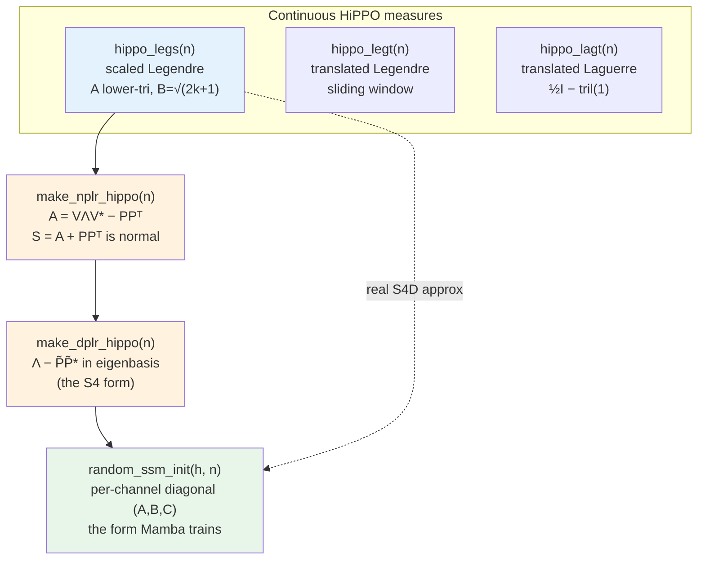

# 02 — HiPPO Theory: Optimal Memory for State Space Models

> Source code: [`mamba/core/hippo.py`](../mamba/core/hippo.py)
> Tests: [`tests/unit/test_hippo.py`](../tests/unit/test_hippo.py),
> reconstruction fixture in [`tests/conftest.py`](../tests/conftest.py)

## Overview

A linear state space model (SSM) carries information through time in a single
state vector `x(t) ∈ ℝᴺ` governed by `x'(t) = A x(t) + B u(t)`. The matrix `A`
decides *what the state remembers*. If we initialize `A` randomly, the model
forgets the distant past long before training can teach it otherwise — the
gradient signal through long sequences vanishes or explodes.

**HiPPO** — *High-order Polynomial Projection Operators* [Gu et al., 2020] —
removes this failure mode. It derives `A` and `B` so that the state `x(t)`
holds the **optimal coefficients of an orthogonal-polynomial expansion of the
entire input history**. The state becomes a compressed, mathematically optimal
summary of everything seen so far, with provably uniform memory across time.
This is the initialization that makes S4 [Gu et al., 2021] and Mamba
[Gu & Dao, 2023] trainable on sequences of tens of thousands of steps. This
document derives the three classical HiPPO measures, the Normal-Plus-Low-Rank
(NPLR) factorization that gives `O(N)` algorithms, and walks through every line
of `mamba/core/hippo.py`.



---

## Mathematical Background

### Motivation: why random `A` fails for long-range dependencies

Training an SSM is backpropagation through a linear recurrence. After
discretizing the continuous system with step `Δ`, the state update is a
first-order linear recurrence with transition matrix `Ā` (for zero-order hold,
`Ā = exp(ΔA)`):

```math
x_t = \bar{A}\,x_{t-1} + \bar{B}\,u_t .
```
The state at step `t` is the previous state pushed through `Ā` plus the new
input — exactly the form a recurrent net unrolls during training.

Unrolling `L` steps and taking the gradient of a late state with respect to an
early one gives a *product* of transition matrices:

```math
\frac{\partial x_t}{\partial x_s} = \prod_{j=s+1}^{t} \bar{A}
= \bar{A}^{\,t-s}, \qquad
\bigl\lVert \bar{A}^{\,t-s} \bigr\rVert \sim \rho(\bar{A})^{\,t-s},
```
The sensitivity of a far-future state to a past one grows or shrinks like the
spectral radius `ρ(Ā)` raised to the time gap.

If `ρ(\bar A) < 1` the gradient **vanishes** and the model cannot learn
dependencies more than a few steps apart; if `ρ(\bar A) > 1` it **explodes** and
training diverges. A random `A` scatters eigenvalues with no control over
`ρ(\bar A)`, so one pathology is essentially guaranteed on long sequences. We
need an `A` whose dynamics deliberately retain a faithful summary of the *whole*
history while staying stable (`Re λ(A) < 0`) — which HiPPO constructs from an
approximation-theoretic first principle rather than from chance.

### The HiPPO framework: online function approximation

HiPPO reframes "remembering the past" as *online function approximation*. At
every time `t` we want the state `c(t) ∈ ℝᴺ` to be the best `N`-term
approximation of the input seen so far, `u(x)` for `x ≤ t`, measured against a
weighting (a probability measure) `ω^{(t)}`.

Fix a family of polynomials `{g_n}` that are **orthonormal** under `ω^{(t)}`
(`⟨g_n, g_m⟩ = δ_{nm}`): unit-length and mutually perpendicular under the chosen
weighting, so projecting onto them is a clean coordinate read-off. The optimal
coefficients of the projection are inner products of the history with each basis
function:

```math
c_n(t) = \langle u_{\le t},\, g_n \rangle_{\omega^{(t)}}
= \int_{-\infty}^{t} u(x)\, g_n^{(t)}(x)\, \omega^{(t)}(x)\, dx .
```
Each coordinate `cₙ(t)` measures how much of basis shape `n` is present in the
input history up to time `t`.

The key result of [Gu et al., 2020] is that, for the standard measures, the
time derivative of these coefficients is a **closed linear ODE** — the *HiPPO
operator*:

```math
\frac{d}{dt} c(t) = A(t)\, c(t) + B(t)\, u(t).
```
The optimal memory state updates itself using only the current state and the
current input — no need to re-scan the past, which is what makes it usable as
an SSM.

Why is it closed? Differentiating `cₙ(t)` under the integral sign produces three
terms — the moving integration limit, the time-dependent normalization, and the
derivative of the basis — and each re-expresses in the *same* basis via the
three-term recurrence and derivative identities of orthogonal polynomials, so
the result collapses back onto `{c_k(t)}` linearly. The measure fixes `A(t)`,
`B(t)`.

### HiPPO-LegS (scaled Legendre)

**LegS** uses the uniform measure over the *entire* growing history `[0, t]`,
rescaled as `t` grows:

```math
\omega^{(t)}(x) = \frac{1}{t}\,\mathbb{1}_{[0,t]}(x),
\qquad
g_n^{(t)}(x) = \sqrt{2n+1}\; P_n\!\left(\frac{2x}{t}-1\right),
```
The window always covers all of history `[0,t]`, and the basis is the standard
Legendre polynomial `Pₙ` shifted to `[0,t]` and scaled to unit norm.

Carrying out the differentiation for this measure yields a *time-invariant*
matrix scaled by `1/t`:

```math
\frac{d}{dt} c(t) = \frac{1}{t}\bigl( A\, c(t) + B\, u(t) \bigr),
```
The dynamics are the same at every time, only slowed by `1/t` — this scale
invariance is what gives LegS uniform memory over all of history.

The entries (matching `hippo_legs`, with `pₖ = √(2k+1)`) are:

```math
A_{nk} = -\begin{cases}
    \sqrt{2n+1}\,\sqrt{2k+1} & n > k \\[2pt]
    n + 1                    & n = k \\[2pt]
    0                        & n < k
\end{cases}
\qquad
B_k = \sqrt{2k+1}.
```
`A` is lower triangular with a strictly negative diagonal `−(k+1)`, and `B`
injects each Legendre mode with its normalization constant.

**Spectral properties.** Because `A` is lower triangular, its eigenvalues are
exactly its diagonal entries:

```math
\lambda_k(A) = -(k+1), \qquad k = 0, 1, \dots, N-1,
```
Every eigenvalue is real and negative — the system is BIBO-stable — and they
spread linearly from `−1` to `−N`, giving a spectrum of decay timescales rather
than one. (Asserted by `test_eigenvalue_real_parts_negative` and
`test_A_is_lower_triangular`.)

**Why it captures history uniformly.** Because the measure is uniform on `[0,t]`
and merely *rescaled* as `t` grows, an event at relative position `x/t`
contributes the same regardless of `t`: no region of the past is privileged,
exactly the property long-range modeling needs. (`test_approximation_quality`
checks that a 64-state LegS basis reconstructs a smooth multi-frequency signal to
`MSE < 1e-3`.)

### HiPPO-LegT (translated Legendre) and HiPPO-LagT (translated Laguerre)

The other two classical measures bias memory toward the *recent* past instead
of weighting all history equally.

**LegT** projects onto Legendre polynomials over a **sliding fixed-length
window** `[t-θ, t]`. Its matrix (matching `hippo_legt`, with `Rₖ = √(2k+1)` and
row/column indices `r, c`) is:

```math
A_{rc} = -R_r\, R_c \times
\begin{cases} (-1)^{\,r-c} & r < c \\[2pt] 1 & r \ge c \end{cases},
\qquad B_r = R_r = \sqrt{2r+1}.
```
Entries on and below the diagonal share one sign while entries above alternate
sign, encoding a window that has a hard boundary at `t-θ`.

*Memory bias:* LegT remembers the last `θ` units of input uniformly and forgets
everything older the instant it leaves the window — ideal when only a bounded
recent context matters, but it cannot represent dependencies longer than `θ`.
LegT is the operator underlying the Legendre Memory Unit [Voelker et al., 2019].

**LagT** projects onto Laguerre functions, whose natural domain is exponential
weighting of the recent past. Its matrix (matching `hippo_lagt`) is a clean
closed form:

```math
A = \tfrac12 I - \operatorname{tril}(\mathbf{1}),
\qquad B = \mathbf{1},
```
The diagonal is `−½`, every strictly-lower entry is `−1`, and `B` injects each
state equally — a fully data-independent, structure-only operator.

*Memory bias:* `A` is lower triangular with constant diagonal `−½`, so all
eigenvalues equal `−½` and the memory of an input decays like `e^{-t/2}`. LagT
weights the recent past most heavily and forgets the distant past
exponentially. (`test_lagt_closed_form` checks the exact matrix;
`test_lagt_stable` checks the negative spectrum.)

The contrast is the whole point: **LegS is the only one of the three with
uniform, scale-invariant memory over unbounded history**, which is why S4 and
Mamba build on it.

### NPLR representation: Normal-Plus-Low-Rank

LegS gives optimal memory but a computational headache: `A` is **non-normal**
(`A Aᵀ ≠ Aᵀ A`), so it cannot be diagonalized by a *unitary* change of basis and
its eigenvector matrix is wildly ill-conditioned — computing `exp(ΔA)` or the SSM
kernel in the eigenbasis is numerically hopeless. The escape, used by S4
[Gu et al., 2021], is that LegS is **normal plus low-rank**. Define the rank-1
factor (matching `make_nplr_hippo`):

```math
P_k = \sqrt{k + \tfrac12}, \qquad k = 0, 1, \dots, N-1 .
```
`P` is the single column whose outer product `PPᵀ` repairs the non-normal part
of `A`.

Adding `PPᵀ` to `A` produces a matrix `S` that *is* normal:

```math
S = A + P P^\top, \qquad
A = S - P P^\top = V \Lambda V^{*} - P P^\top .
```
We split LegS into a well-behaved normal core `S` plus a rank-1 correction; the
core can be diagonalized cleanly and the correction is cheap to carry.

To see why `S` is normal, substitute `A_{nk}` and `P_n P_k = \tfrac12\sqrt{2n+1}\sqrt{2k+1}`:

```math
S_{nk} = \begin{cases}
    -\tfrac12\sqrt{2n+1}\sqrt{2k+1} & n > k \\[2pt]
    -\tfrac12                       & n = k \\[2pt]
    +\tfrac12\sqrt{2n+1}\sqrt{2k+1} & n < k
\end{cases}
\;=\; -\tfrac12 I + \text{(skew-symmetric)} .
```
`S` is a constant `−½` on the diagonal plus an antisymmetric part — and a
scaled identity plus a skew-symmetric matrix is always normal.

Because the diagonal is the *constant* `−½`, subtracting it leaves a purely
skew-symmetric matrix, and multiplying a real skew-symmetric matrix by `−i`
makes it **Hermitian**:

```math
S + \tfrac12 I \;=\; \text{skew}, \qquad
H = -i\,\text{skew} = H^{*} .
```
Shifting out the known diagonal isolates the skew part, and the `−i` rotation
turns it into a Hermitian matrix that `torch.linalg.eigh` can diagonalize with
real eigenvalues and a guaranteed-unitary eigenvector matrix.

Diagonalizing `H` gives real eigenvalues `μ` and unitary `V`; the eigenvalues of
`S` (hence the diagonal `Λ`) are recovered by undoing the shift and rotation:

```math
H V = \mu V \;\Rightarrow\; \text{skew}\,V = i\mu\, V
\;\Rightarrow\; \lambda_k(S) = -\tfrac12 + i\,\mu_k .
```
Every eigenvalue of the normal part has **real part exactly `−½`** and a purely
imaginary spread `iμ`, so the spectrum sits on a vertical line in the complex
plane — stable, with oscillation frequencies set by `μ`.

Transforming the low-rank factor and input into this eigenbasis
(`make_dplr_hippo`) yields the **Diagonal-Plus-Low-Rank (DPLR)** form S4
actually trains:

```math
V^{*} A V = \Lambda - (V^{*}P)(V^{*}P)^{*}
= \Lambda - \tilde{P}\tilde{P}^{*}, \qquad
\tilde{B} = V^{*} B .
```
In the eigenbasis the operator is a complex diagonal `Λ` plus a rank-1
correction — a representation in which the SSM kernel costs `O(N)` instead of
`O(N²)` per step.

The `O(N)` payoff comes from the **Woodbury identity**, which inverts a
diagonal-plus-low-rank matrix without ever forming a dense inverse:

```math
(A + P Q^{\top})^{-1}
= A^{-1} - A^{-1} P\,(I + Q^{\top} A^{-1} P)^{-1} Q^{\top} A^{-1}.
```
A rank-`k` update to an easily-invertible (diagonal) matrix can be inverted with
only a `k×k` solve, which is what reduces S4's Cauchy-kernel evaluation to
linear cost. (Verified by `test_woodbury_identity`; the reconstruction
`A = VΛV* − PPᵀ` by `test_nplr_reconstruction`.)

---

## Implementation Notes

All math is done in `float64` for numerical accuracy and cast down to
`float32`/`complex64` on return. Indices follow the math: `n` is the row /
output mode, `k` the column / input mode.

### `hippo_legs(n) -> (A, B)`  — lines 47-93

```python
p = torch.sqrt(1.0 + 2.0 * torch.arange(n, dtype=torch.float64))  # pₖ = √(2k+1)
A = p[:, None] * p[None, :]                  # outer product  Aₙₖ = √(2n+1)√(2k+1)
A = torch.tril(A) - torch.diag(torch.arange(n, dtype=torch.float64))
A = -A                                        # apply the global minus sign
B = torch.sqrt(2.0 * torch.arange(n, dtype=torch.float64) + 1.0)   # Bₖ = √(2k+1)
```

- `p[:, None] * p[None, :]` builds the outer product `√(2n+1)√(2k+1)`.
- `torch.tril(...)` keeps only `n ≥ k`, leaving `(2k+1)` on the diagonal;
  subtracting `diag(k)` turns each diagonal entry into `(2k+1) − k = k+1`.
- `A = -A` applies the leading minus, giving `−√(2n+1)√(2k+1)` off-diagonal and
  `−(k+1)` on the diagonal — lower triangular and strictly stable.
- **Returns** `A` `(N, N)` and `B` `(N,)`, both `float32`.

### `hippo_legt(n) -> (A, B)`  — lines 96-139

```python
R = torch.sqrt(2.0 * q + 1.0)                 # Rₖ = √(2k+1)
sign = torch.where(row < col, (-1.0) ** (row - col), torch.ones(n, n, ...))
A = -(R[:, None] * sign * R[None, :])         # signed outer product
B = R.clone()                                 # Bₖ = √(2k+1)
```

- `sign` is `(-1)^{r-c}` above the diagonal (`r < c`) and `1` on/below it,
  encoding the alternating window structure.
- `A` is the elementwise product of `R` (rows), `sign`, and `R` (cols), negated.
- **Returns** `(N, N)` `A` and `(N,)` `B`, both `float32`.

### `hippo_lagt(n) -> (A, B)`  — lines 142-172

```python
A = 0.5 * torch.eye(n, ...) - torch.tril(torch.ones(n, n, ...))   # ½I − tril(1)
B = torch.ones(n, ...)                                            # B = 1
```

- A direct transcription of `A = ½I − tril(𝟙)`: diagonal `−½`, strictly-lower
  entries `−1`, upper entries `0`.
- **Returns** `(N, N)` `A` and the all-ones `(N,)` `B`, both `float32`.

### `make_nplr_hippo(n) -> (w, P, B, V)`  — lines 175-238

```python
A, B = hippo_legs(n)                          # start from LegS (in float64)
P = torch.sqrt(torch.arange(n, ...) + 0.5)    # Pₖ = √(k + ½)
S = A + P[:, None] * P[None, :]               # normal part  S = A + PPᵀ
diag_val = torch.mean(torch.diagonal(S))      # == −0.5  (constant diagonal)
skew = S - diag_val * torch.eye(n, ...)       # exactly skew-symmetric
H = -1j * skew.to(torch.complex128)           # −i·skew is Hermitian
mu, V = torch.linalg.eigh(H)                  # μ real ascending, V unitary
w = diag_val.to(torch.complex128) + 1j * mu   # λ(S) = −½ + iμ
```

- `P = √(k + ½)` is the rank-1 factor; `PPᵀ = ½ ppᵀ` cancels the non-normal
  half of `A`, so `S = A + PPᵀ` is normal with constant diagonal `−½` (read off
  robustly by `diag_val = mean(diag(S))`).
- `skew = S − (−½)I` is purely skew-symmetric, so `H = −i·skew` is Hermitian and
  `eigh` returns **real** `μ` with a truly **unitary** `V` (far more stable than
  `eig` on the non-normal `A`). Then `w = −½ + iμ` are the eigenvalues of `S`.
- **Returns** `w` `(N,)` `complex64`, `P` `(N,)` `float32`, `B` `(N,)`
  `float32`, `V` `(N, N)` `complex64`.

### `make_dplr_hippo(n, rank=1, dtype=complex64) -> (Λ, P, B, V)`  — lines 241-289

```python
w, P, B, V = make_nplr_hippo(n)
Vh = V.conj().transpose(-1, -2)               # V*
P_eig = (Vh @ P.to(V.dtype)).reshape(1, n)    # P̃ = V* P, shape (1, N)
# rank > 1: zero-pad extra rows (LegS is genuinely rank 1)
B_eig = Vh @ B.to(V.dtype)                     # B̃ = V* B
```

- Conjugating the NPLR factors by `V` moves into the eigenbasis where the
  operator is `Λ − P̃P̃*` — the diagonal-plus-low-rank S4 parameterization.
- LegS has true rank 1; `rank > 1` zero-pads `P_eig` to `(rank, N)` so callers
  can request a wider low-rank slot.
- Guards reject non-positive `rank` and non-complex `dtype`.
- **Returns** `Λ` `(N,)`, `P` `(rank, N)`, `B` `(N,)`, `V` `(N, N)`, all the
  requested complex `dtype`.

### `random_ssm_init(h, n, dtype=float32) -> (A, B, C)`  — lines 292-349

This produces the **per-channel diagonal** SSM that Mamba actually trains, one
independent `(A, B, C)` row per channel.

- **Complex dtype:** repeats the HiPPO-LegS eigenvalues `Λ` and eigenbasis input
  `B̃` from `make_dplr_hippo` across `H` channels.
- **Real dtype:** uses the **S4D-real** init [Gu et al., 2022], `A = −(1, …, N)`
  (a real approximation to the LegS spectrum, the diagonal Mamba's `A_log` is
  built from) with `B` all ones.
- `C = randn(h, n) / √n` gives output gains with roughly unit scale.
- Two **HiPPO invariants** are asserted before returning: every state value has
  strictly negative real part (stability) and `B` is finite (non-degenerate).
- **Returns** `A`, `B`, `C` each of shape `(H, N)`.

### Visualization guide

The reconstruction-quality check lives in the `legs_recon_mse` fixture in
[`tests/conftest.py`](../tests/conftest.py); it is the template for any HiPPO
visualization. The recipe has two halves.

**1. Integrate the LegS ODE to get coefficients.** Step the scaled LegS ODE
`c' = (1/t)(A c + B u)` with a midpoint (RK2) integrator using the *actual*
`hippo_legs` matrices, accumulating the projection coefficients `c ∈ ℝᴺ` as the
signal streams in:

```python
a, b = hippo_legs(n)                       # the real matrices under test
a_np, b_np = a.double().numpy(), b.double().numpy()
c = np.zeros(n); dt = 1.0 / length
for k in range(1, length + 1):
    t = k * dt
    f1 = (1.0 / t) * (a_np @ c + b_np * signal[k - 1])       # slope at start
    c_half = c + 0.5 * dt * f1                               # midpoint state
    f2 = (1.0 / t) * (a_np @ c_half + b_np * signal[k - 1])  # midpoint slope
    c = c + dt * f2                                          # RK2 update
```

**2. Reconstruct from the normalized Legendre basis** using
`numpy.polynomial.legendre`. Map `x ∈ [0,1]` to `xx = 2x − 1 ∈ [-1,1]`, then sum
each mode `cⱼ · √(2j+1) · Pⱼ(xx)` — `legval` with a one-hot coefficient vector
evaluates the `j`-th Legendre polynomial:

```python
from numpy.polynomial import legendre as _leg
xx = 2.0 * np.linspace(0, 1, length) - 1.0
recon = np.zeros(length)
for j in range(n):
    coef = np.zeros(j + 1); coef[j] = 1.0           # select Pⱼ
    recon += c[j] * np.sqrt(2 * j + 1) * _leg.legval(xx, coef)
```

To **plot the basis functions**, drop the coefficients and plot
`√(2j+1) · legval(xx, one_hot(j))` for the first few `j` — the orthonormal shapes
the SSM state projects onto. To **plot approximation quality**, overlay `recon`
on `signal` and watch them converge as `n` grows; the fixture scores the gap as
the interior MSE `mean((recon − signal)²)` (trimming the boundary, where
integration error concentrates). `test_approximation_quality` asserts this drops
below `1e-3` for `n = 64` on a smooth three-tone signal.

---

## Common Pitfalls

- **Diagonalizing `A` directly.** LegS `A` is non-normal; `torch.linalg.eig(A)`
  returns an ill-conditioned eigenvector matrix and a garbage kernel. Always go
  through `make_nplr_hippo`, which diagonalizes the *normal* part `S` via the
  Hermitian `−i·skew` with `eigh` — in `complex128`, casting only the returns.
- **Index / sign confusion.** The paper writes `c' = −(1/t)(A c − B u)` with
  positive `A`; this codebase folds the minus in, so `hippo_legs` returns the
  negated `A` and the ODE is `c' = (1/t)(A c + B u)`. Mixing conventions flips
  stability.
- **Forgetting the `1/t` scaling.** LegS is *scaled* Legendre: the matrices are
  time-invariant but the measure rescales. Dropping the `1/t` factor (or
  discretizing with a fixed `Δ`) destroys the uniform-memory property.
- **`P P^\top` vs `½ p p^\top`.** Because `Pₖ = √(k+½)`, the rank-1 term is
  *half* the LegS off-diagonal magnitude; using `pₖ = √(2k+1)` would over-correct
  and `S` would not be normal.
- **Choosing LegT/LagT for long range.** Only LegS has uniform, unbounded
  memory; LegT forgets past its window `θ` and LagT decays exponentially. For
  long-range modeling, initialize from LegS (or its S4D-real diagonal).

---

## References

- **[Gu et al., 2020]** A. Gu, T. Dao, S. Ermon, A. Rudra, C. Ré. *HiPPO:
  Recurrent Memory with Optimal Polynomial Projections.* NeurIPS 2020. — the
  HiPPO framework, the LegS/LegT/LagT operators, and the optimality theorems.
- **[Gu et al., 2021]** A. Gu, K. Goel, C. Ré. *Efficiently Modeling Long
  Sequences with Structured State Spaces (S4).* ICLR 2022 (arXiv 2021). — the
  NPLR/DPLR factorization, the Cauchy/Woodbury kernel, and `O(N)` algorithms.
- **[Gu et al., 2022]** A. Gu, A. Gupta, K. Goel, C. Ré. *On the
  Parameterization and Initialization of Diagonal State Space Models (S4D).*
  NeurIPS 2022. — the S4D-real diagonal `A = −(1, …, N)` used in the real-dtype
  branch of `random_ssm_init`.
- **[Voelker et al., 2019]** A. Voelker, I. Kajić, C. Eliasmith. *Legendre
  Memory Units: Continuous-Time Representation in Recurrent Neural Networks.*
  NeurIPS 2019. — the translated-Legendre (LegT) memory cell.
- **[Gu & Dao, 2023]** A. Gu, T. Dao. *Mamba: Linear-Time Sequence Modeling with
  Selective State Spaces.* 2023. — the selective SSM these initializations feed.

**Next:** [03 — S4 Architecture](03_s4_architecture.md) turns the DPLR
factorization into the structured convolution kernel.
