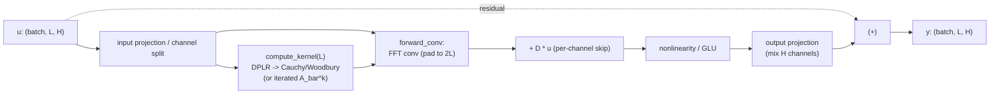

# 03 — The S4 Architecture

> Structured State Spaces (S4), built from scratch. This chapter connects the
> HiPPO initialization in `mamba/core/hippo.py` to the linear time-invariant
> (LTI) state space model in `mamba/core/ssm_base.py`, and explains the
> Diagonal-Plus-Low-Rank (DPLR) machinery that makes S4 fast.

---

## Overview

S4 is a sequence model whose core is a *linear, time-invariant* state space
model (SSM):

```math
x'(t) = A\,x(t) + B\,u(t), \qquad y(t) = C\,x(t) + D\,u(t)
```

The hidden state `x(t)` is driven by the input `u(t)` through `A` and `B`, and
the output `y(t)` reads the state out through `C` plus a direct skip `D`.

Three facts make S4 work, and each maps onto code in this repository:

1. **A good `A` matrix.** A randomly initialized `A` forgets the past; HiPPO
   (`hippo_legs`, `make_nplr_hippo`, `make_dplr_hippo` in
   `mamba/core/hippo.py`) gives an `A` whose state stores an optimal polynomial
   summary of the entire input history.
2. **A fast kernel.** The HiPPO `A` is non-normal, so it cannot be diagonalized
   cheaply. The DPLR parameterization (`make_dplr_hippo`) rewrites it as a
   diagonal plus a rank-1 term, which turns kernel evaluation into a set of
   *Cauchy dot products* solvable with the Woodbury identity.
3. **Two equivalent execution modes.** The same parameters can run as a parallel
   convolution (training) or a stepwise recurrence (inference). `SSMBase` in
   `mamba/core/ssm_base.py` fixes this dual contract and dispatches between the
   two.

This chapter assumes you know PyTorch and linear algebra. It is pedagogically
progressive: we build the kernel algebra first, then the layer, then the
engineering concerns.

---

## Mathematical Background

### From HiPPO to S4: the DPLR parameterization

S4 starts from **HiPPO-LegS** (`hippo_legs(n)`), which returns a dense
`(N, N)` lower-triangular matrix `A` and an `(N,)` vector `B`. Because `A` is
lower-triangular and non-symmetric it is **non-normal**: there is no unitary
basis that diagonalizes it, so we cannot reduce the `O(N^2)` matrix-vector
products in the recurrence to `O(N)` element-wise ones by a clean change of
basis.

The fix is the **Normal-Plus-Low-Rank (NPLR)** factorization
(`make_nplr_hippo(n)`), which writes HiPPO-LegS as a normal matrix minus a
rank-1 correction:

```math
A = V\,\Lambda\,V^{*} \;-\; P P^{\top}, \qquad P_k = \sqrt{k + \tfrac12}
```

HiPPO-LegS equals a unitarily-diagonalizable *normal* part `V Λ V*` minus a
rank-1 outer product `P Pᵀ`, recovering the full matrix exactly.

In code `make_nplr_hippo` returns `(w, P, B, V)` where `w = Λ`, and this
reconstruction is checked in `tests/unit/test_hippo.py::TestNPLR::test_nplr_reconstruction`
via `A = V diag(w) V* - outer(P, P)`. The normal part is built by symmetrizing:
`S = A + P Pᵀ`, whose diagonal is the constant `-1/2`, so `S + ½I` is exactly
skew-symmetric and is diagonalized through the Hermitian matrix `-i(S + ½I)`.

The **DPLR parameterization** (`make_dplr_hippo(n)`) is just NPLR rotated into
the eigenbasis of the normal part. Conjugating the whole system by `V*` (set
`x = V* x'`) leaves the input/output map unchanged but makes the state matrix
diagonal-plus-low-rank:

```math
\widetilde{A} \;=\; \Lambda \;-\; \widetilde{P}\,\widetilde{Q}^{*},
\qquad \widetilde{P} = V^{*}P,\;\; \widetilde{Q} = V^{*}Q,\;\;
\widetilde{B} = V^{*}B,\;\; \widetilde{C} = C\,V
```

In the eigenbasis the state matrix is a **complex diagonal `Λ` minus a low-rank
outer product**, and `B`, `C` are rotated accordingly so the model is identical.

`make_dplr_hippo` returns `Lambda, P, B, V`:

- `Lambda` — `(N,)` complex diagonal with real part `-1/2` (stable: every pole
  is strictly in the left half-plane).
- `P` — `(rank, N)` complex low-rank factor `V* P_original` (HiPPO-LegS has true
  `rank = 1`; extra rows are zero-padded for `rank > 1`).
- `B` — `(N,)` complex input vector `V* B_original`.
- `V` — `(N, N)` complex change-of-basis (eigenvectors of the normal part).

Two subtleties worth pinning down:

- **Where are `Q` and `C`?** The general S4 DPLR form is `A = Λ - P Q*` with a
  *distinct* `Q`. HiPPO-LegS is the special case `Q = P` (the correction
  `P Pᵀ` is symmetric), which is why `make_dplr_hippo` returns only `P`. The
  output matrix `C` is not part of the HiPPO geometry — it is a learnable
  read-out, initialized randomly (see `random_ssm_init`, where
  `C = randn(h, n) / sqrt(n)`).
- **Conjugate symmetry.** The eigenvalues come in complex-conjugate pairs
  (verified in `tests/unit/test_hippo.py::TestDPLR::test_complex_conjugate_pairs`).
  This guarantees the final real-valued kernel and lets an implementation keep
  only half the spectrum and double the real part.

### The Cauchy kernel and the Woodbury identity

The SSM convolution kernel is the sequence of "tap" responses:

```math
\bar K \;=\; \big(\bar C\bar B,\; \bar C\bar A\bar B,\; \bar C\bar A^{2}\bar B,\;\dots,\; \bar C\bar A^{L-1}\bar B\big),
\qquad \bar K_k = \bar C\,\bar A^{k}\,\bar B
```

Each kernel tap `k` is the response `C Ā^k B`, and the output is `u` convolved
with this kernel.

The naive way to build `K` is to iterate `v ← Ā v` and read off `C v` — exactly
what `ContinuousSSM.compute_kernel` in `mamba/core/ssm_base.py` does (a dense,
real, `O(N^2 L)` reference implementation). DPLR lets us do far better by
working with the kernel's **truncated generating function** evaluated on the
unit circle:

```math
\widehat{\mathcal{K}}_L(z) \;=\; \sum_{k=0}^{L-1} \bar C\,\bar A^{k}\,\bar B\;z^{k}
\;=\; \widetilde{C}\,(I - \bar A z)^{-1}\,\bar B,
\qquad \widetilde{C} = \bar C\,(I - \bar A^{L})
```

Summing the truncated geometric series collapses the kernel into a single matrix
resolvent, where `C̃` absorbs the truncation factor `(I - Ā^L)`.

Using the **bilinear (Tustin) discretization** `Ā = (I - Δ/2·A)^{-1}(I + Δ/2·A)`
(see `mamba/core/discretize.py::bilinear`), the discrete resolvent simplifies to
a *continuous* resolvent of `A` at a Möbius-warped frequency:

```math
\widehat{\mathcal{K}}_L(z) \;=\; \frac{2}{1+z}\;\widetilde{C}\,\Big(g(z)\,I - A\Big)^{-1} B,
\qquad g(z) = \frac{2}{\Delta}\,\frac{1-z}{1+z}
```

The truncated kernel's `z`-transform is the continuous-time resolvent `(gI − A)⁻¹`
evaluated at the warped frequency `g(z)`, scaled by `2/(1+z)`.

Now substitute the DPLR form `A = Λ - P Q*`. The matrix we must invert is
diagonal plus low-rank, `gI - A = (gI - Λ) + P Q*`, and this is precisely where
the **Woodbury matrix identity** earns its keep:

```math
\big(A + U V^{*}\big)^{-1} \;=\; A^{-1} - A^{-1}U\,\big(I + V^{*}A^{-1}U\big)^{-1}V^{*}A^{-1}
```

The inverse of a matrix plus a low-rank update equals the base inverse minus a
correction that only inverts a small `r×r` matrix — never the full `N×N`.

This exact identity is verified numerically (to `atol=1e-9`) in
`tests/unit/test_hippo.py::TestNPLR::test_woodbury_identity`, using
`(A + P Qᵀ)⁻¹ = A⁻¹ − A⁻¹P(I + QᵀA⁻¹P)⁻¹QᵀA⁻¹`.

Apply Woodbury with base `D = gI - Λ` (which is **diagonal**, so `D⁻¹` is a free
element-wise reciprocal), `U = P`, `V = Q`:

```math
\big(gI - A\big)^{-1} = D^{-1} - D^{-1}P\,\big(I + Q^{*}D^{-1}P\big)^{-1}Q^{*}D^{-1},
\qquad D = gI - \Lambda
```

Because the base is diagonal, the only genuine inverse left is the tiny
`r×r` (rank-1 for HiPPO) matrix `(I + Q* D⁻¹ P)`.

Every term collapses into a **Cauchy dot product** — a sum of element-wise
products divided by `(g - Λ_n)`:

```math
\langle a, b\rangle_g \;=\; \sum_{n=1}^{N} \frac{\bar a_n\, b_n}{\,g - \Lambda_n\,}
```

Each required quantity is a Cauchy kernel: an `O(N)` weighted sum over the
diagonal poles `Λ_n`, evaluable for all frequencies simultaneously.

Putting it together (rank-1 case, so the middle inverse is a scalar):

```math
\widehat{\mathcal{K}}_L(z) = \frac{2}{1+z}\left[\;
\langle \widetilde{C}, B\rangle_g
\;-\;
\frac{\langle \widetilde{C}, P\rangle_g\,\langle Q, B\rangle_g}{1 + \langle Q, P\rangle_g}
\;\right]
```

The whole kernel transform is one Cauchy dot product minus a scalar Woodbury
correction assembled from three more — all `O(N)` per frequency.

Finally, evaluate at the `L`-th roots of unity and inverse-FFT to recover the
real time-domain kernel:

```math
\bar K \;=\; \mathrm{iFFT}\Big(\widehat{\mathcal{K}}_L(\omega^{k})\Big)_{k=0}^{L-1},
\qquad \omega = e^{-2\pi i / L}
```

Sampling the `z`-transform on the unit-circle roots of unity and inverse-FFT-ing
returns the convolution kernel — the entire pipeline costs
`O\big((N + L)\log L\big)` instead of the naive `O(N^2 L)`.

---

## Implementation Notes

### The S4 layer

A single S4 layer wraps the SSM with the projections and residual that turn it
into a drop-in sequence block. With an input `u ∈ (batch, L, H)`:

1. **Input handling.** Each of the `H` feature channels is treated as an
   independent 1-D signal fed to its own SSM (a linear input projection may
   precede this to mix channels).
2. **SSM convolution.** Per channel `h`, compute the kernel `K_h` of length `L`
   and convolve. `ContinuousSSM.forward_conv` does this with the FFT in
   `O(L log L)`, zero-padding to `fft_len = 2L` for a *linear* (non-circular)
   convolution.
3. **Skip / direct term.** The `D` term is a per-channel pass-through added
   inside the SSM: `forward_conv` returns `y + u * D` (and `forward_recurrent`
   adds `D * u_t` each step).
4. **Output projection.** A linear layer mixes the per-channel SSM outputs back
   into `H` features (often with a GLU / nonlinearity between SSM and mixing).
5. **Residual.** The block output is added to the block input (standard residual
   connection around the layer).



The diagram shows the S4 dataflow: the kernel feeds the FFT convolution, the
direct `D` term is the inner skip, and a residual wraps the whole block.

Note that `ContinuousSSM` itself is **single-input single-output** (it maps
`(batch, L) → (batch, L)`); the layer realizes the multi-channel block by
running `H` such SSMs in parallel, which is the topic of the next section.

### Multi-input multi-output (MIMO) SSMs

S4 (and Mamba) do not use one large coupled MIMO system. Instead they run `H`
**independent SISO SSMs**, one per feature channel, each with its own state of
size `N`. This is the `H × N` design:

```math
A \in \mathbb{C}^{H\times N}, \quad B \in \mathbb{C}^{H\times N}, \quad C \in \mathbb{C}^{H\times N}
```

`A`, `B`, `C` are `(H, N)` tensors: row `h` holds the `N` diagonal poles, input
gains, and output gains for channel `h` — there is no `N×N` coupling, so the
parameter count is `O(H N)` rather than `O(H N^2)`.

This is exactly `random_ssm_init(h, n)` in `mamba/core/hippo.py`, which returns
`(A, B, C)` each of shape `(H, N)`. Its initialization scheme reveals the
parameter-sharing policy:

- **Complex dtype:** the HiPPO-LegS DPLR spectrum is shared across channels —
  `A = Lambda.unsqueeze(0).repeat(h, 1)` and `B = B_eig...repeat(h, 1)`.
- **Real dtype (S4D-real):** the diagonal `A_n = -(n+1)` (a real approximation
  to the HiPPO spectrum) is shared — `A = a.unsqueeze(0).repeat(h, 1)`,
  `B = ones(h, n)`.
- **Always independent:** `C = randn(h, n) / sqrt(n)` is sampled per channel.

So `A` and `B` *start* shared (a good HiPPO prior) while `C` starts independent;
all three become per-channel learnable during training. Crucially, the `(H, N)`
**diagonal** form drops the low-rank `P Q*` term from DPLR entirely — this is the
**S4D** ("diagonal SSM") simplification [Gu et al., 2022], which keeps almost all
of S4's quality while making the kernel a pure diagonal Vandermonde product. The
function also asserts the HiPPO invariants: every pole has `Re(A) < 0`
(stability) and `B` is finite.

### Training vs inference: mode switching

`SSMBase` (`mamba/core/ssm_base.py`) encodes the recurrent/convolutional duality
as an abstract contract: subclasses implement `compute_kernel`,
`forward_conv`, and `forward_recurrent`, and the base `forward` dispatches.

- `set_training_mode(mode)` pins the mode to `"auto"`, `"conv"`, or
  `"recurrent"`.
- `_use_conv()` resolves the choice: `"conv"` → always convolution,
  `"recurrent"` → always recurrence, `"auto"` → convolution while
  `self.training`, recurrence otherwise.

**Convolutional mode (training).** Compute the full length-`L` kernel once, then
FFT-convolve over the whole sequence in parallel — `O(L log L)`, ideal for
gradient steps. The kernel depends *only on the parameters* (and `L`), so it is a
natural caching target: recompute it once per parameter update, not per batch
element. The reference `compute_kernel` rebuilds it each call; a production layer
caches it whenever the parameters are unchanged.

**Recurrent mode (inference).** Step the state directly:

```math
h_t = \bar A\,h_{t-1} + \bar B\,u_t, \qquad y_t = C\,h_t + D\,u_t
```

The recurrence carries `O(N)` state and costs `O(1)` per token, which is exactly
what autoregressive decoding needs. `ContinuousSSM.forward_recurrent`
implements this loop.

For inference you discretize the continuous parameters once and reuse the
discrete matrices. `ContinuousSSM.get_ssm_matrices()` returns the cached
`{"A_bar", "B_bar", "C", "D"}` (detached) so an external generation loop can step
without re-running `zoh` every token. The two paths are mathematically identical
for an LTI model; the test suite asserts they agree to `atol=1e-4`.

### Positional encoding: why S4 needs none

S4 is a **continuous-time, linear time-invariant** system, and time-invariance
means the kernel depends only on the *relative* offset between input and output:

```math
y_t = \sum_{k=0}^{t} \bar K_k\, u_{t-k}, \qquad \bar K_k = C\,\bar A^{k}\,\bar B
```

The output at time `t` is a convolution over the past weighted by `Ā^k`, so the
kernel index `k` *is* a relative-position signal baked into the model.

Contrast this with self-attention, which is permutation-equivariant: shuffle the
tokens and the raw attention map is unchanged, so Transformers must *add*
positional encodings. An SSM's recurrence is inherently ordered — position is
implicit in the sequential state update — so no additive positional embedding is
required. The discretization step `Δ` (a learnable `log_dt` in `ContinuousSSM`)
even supplies an adjustable notion of physical time-spacing, letting the model
learn its own timescale rather than memorize absolute indices.

### Implementation checklist: numerical stability

- **Enforce stability of `Λ`.** Keep `Re(Λ) < 0` strictly. Parameterize the
  diagonal as `A = -exp(A_log)` (or via `softplus`) so it can never cross into
  the unstable half-plane; `random_ssm_init` notes that Mamba initializes
  `A_log` from `-(n+1)` and asserts `torch.all(A.real < 0)`.
- **Compute the Cauchy kernel in the log domain.** The Vandermonde/Cauchy sums
  `Σ a_n b_n / (g - Λ_n)` and the powers `Ā^k` can overflow/underflow for long
  `L`; accumulate via `logsumexp`-style reductions and exponentiate at the end.
- **Use proper complex arithmetic.** Conjugate-transpose with
  `V.conj().transpose(-1, -2)` (as `make_dplr_hippo` does, building `Vh`), and
  exploit conjugate symmetry: since `Λ` comes in conjugate pairs, keep half the
  spectrum and take `2 * Re(...)` to get a real kernel.
- **Store complex parameters as real.** Many optimizers and their state buffers
  are happier with real tensors; hold parameters as `(..., 2)` real tensors and
  convert at the boundary with `torch.view_as_complex` / `torch.view_as_real`
  inside `forward`.
- **Discretize robustly.** Prefer ZOH via the augmented-matrix exponential
  (`discretize.zoh`) over the textbook `Ā = e^{ΔA}`, `B̄ = A⁻¹(Ā - I)B`, which
  divides by a singular `A`. For the diagonal case use `discretize.phi`, a stable
  `(e^x - 1)/x` that returns `1 + x/2` near zero to avoid `0/0` and its `NaN`
  gradients.
- **Zero-pad the FFT.** Use `fft_len = 2L` for a linear convolution; a length-`L`
  FFT gives a *circular* convolution that wraps the end of the sequence onto the
  start.
- **Promote the compute dtype.** Run `matrix_exp`, linear solves, and FFTs in at
  least `float32`/`complex64` even when inputs are `float16`/`bfloat16`
  (`discretize._compute_dtype` does this), then cast back.

---

## Common Pitfalls

- **Skipping NPLR/DPLR.** Trying to diagonalize the raw HiPPO-LegS `A` fails — it
  is non-normal. You must split off the low-rank part first.
- **Circular convolution.** Forgetting to zero-pad the FFT to `2L` silently
  contaminates outputs with wrapped-around tail values.
- **Dropping conjugate symmetry.** If you do not pair eigenvalues (or take the
  real part), the kernel comes out complex and the model misbehaves.
- **Unstable poles.** Allowing `Re(Λ) ≥ 0` makes `Ā^k` grow without bound;
  always constrain `A` to be negative-real-part.
- **Singular-`A` discretization.** The `A⁻¹(Ā - I)B` formula blows up when `A`
  is singular (e.g. `A = 0`); use the augmented-matrix ZOH instead.
- **Recomputing the kernel during recurrent decoding.** This defeats the `O(1)`
  per-step cost; cache the discrete matrices via `get_ssm_matrices()`.
- **Conv mode on very long sequences without chunking.** The full kernel and FFT
  buffers can exhaust memory; chunk or switch to the recurrent path.
- **Confusing `P` and `Q`.** General S4 DPLR uses a distinct `Q`; HiPPO-LegS is
  the special case `Q = P`, which is why `make_dplr_hippo` returns only `P`.

---

## References

- **[Gu et al., 2021]** Gu, A., Goel, K., & Ré, C. *Efficiently Modeling Long
  Sequences with Structured State Spaces* (S4). The NPLR/DPLR factorization,
  the Cauchy-kernel + Woodbury algorithm, and the convolutional/recurrent
  duality. Mirrors `make_nplr_hippo` / `make_dplr_hippo` and `SSMBase`.
- **[Gu et al., 2022]** Gu, A., Gupta, A., Goel, K., & Ré, C. *On the
  Parameterization and Initialization of Diagonal State Space Models* (S4D). The
  diagonal `(H, N)` simplification that drops the low-rank term, matching
  `random_ssm_init`.
- **[Gu et al., 2020]** Gu, A., Dao, T., Ermon, S., Rudra, A., & Ré, C. *HiPPO:
  Recurrent Memory with Optimal Polynomial Projections*. The optimal-memory `A`,
  `B` matrices in `hippo_legs` / `hippo_legt` / `hippo_lagt`.
- **[Gu & Dao, 2023]** Gu, A., & Dao, T. *Mamba: Linear-Time Sequence Modeling
  with Selective State Spaces*. The selective (input-dependent) discretization in
  `discretize.selective_zoh`, the sequel to S4 covered in later chapters.

### Source files in this repository

- `mamba/core/hippo.py` — `hippo_legs`, `make_nplr_hippo`, `make_dplr_hippo`,
  `random_ssm_init`.
- `mamba/core/ssm_base.py` — `SSMBase` (mode contract, `set_training_mode`,
  `_use_conv`) and `ContinuousSSM` (`compute_kernel`, `forward_conv`,
  `forward_recurrent`, `get_ssm_matrices`).
- `mamba/core/discretize.py` — `zoh`, `bilinear`, `euler`, `phi`,
  `selective_zoh`.
- `tests/unit/test_hippo.py` — `TestNPLR::test_woodbury_identity`,
  `TestNPLR::test_nplr_reconstruction`, `TestDPLR::test_complex_conjugate_pairs`.
