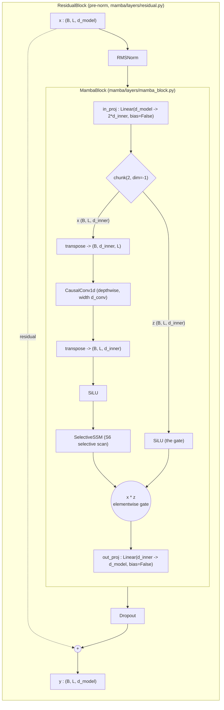

# 04 — Mamba's Selective Mechanism (S6)

## Overview

S4 [Gu et al., 2021] proved that a *linear time-invariant* (LTI) state space
model can match attention on long-range benchmarks while running in linear time.
But "time-invariant" is exactly the property that makes S4 unable to **decide,
based on content, what to keep and what to throw away**. Mamba [Gu & Dao, 2023]
removes that constraint with the **S6** layer: it makes the step size `\Delta`
and the projections `B` and `C` *functions of the input*, turning a fixed filter
into a content-aware one. The price is that the convolutional shortcut S4 relied
on no longer exists, so the recurrence must be evaluated with an associative
**selective scan**.

This document explains *why* selectivity matters and *how* the from-scratch
implementation realises it. The relevant code:

- `mamba/core/selective_ssm.py` — `class SelectiveSSM` (`x_proj`, `dt_proj`,
  `A_log`, `D`, `_project`, `_forward_parallel`, `_forward_recurrent`,
  `_initialize_dt_proj`, `step`).
- `mamba/layers/mamba_block.py` — `class MambaBlock`, the gated unit wrapping it.
- `mamba/ops/selective_scan_naive.py` — the reference (sequential) scan defining
  the semantics the parallel scan must reproduce.
- `mamba/core/discretize.py` (`selective_zoh`) and `mamba/ops/_scan_common.py`
  (`prepare_scan_inputs`, `project_output`) — the shared discretization.

The *internals* of the parallel scan are covered in `docs/05`; here we only
justify why a scan is required at all.

---

## Mathematical Background

Throughout, `D` denotes the inner channel count (`d_inner`), `N` the SSM state
dimension (`d_state`), `L` the sequence length, and `B` the batch size. The SSM
runs **one independent diagonal system per channel**.

### The fundamental limitation of S4: LTI systems cannot filter selectively

S4 discretizes a continuous diagonal system into a fixed recurrence whose
matrices do **not** depend on the time index `t`:

```math
h_t = \bar{A}\, h_{t-1} + \bar{B}\, u_t, \qquad y_t = C\, h_t + D\, u_t,
```

The hidden state is updated and read out with the *same* matrices at every
position, regardless of what the input token actually is.

Because `\bar{A}, \bar{B}, C` are constant in `t`, the map from input to output
is a **convolution** with a single fixed kernel:

```math
y = u * \bar{K}, \qquad
\bar{K} = \big(C\bar{B},\ C\bar{A}\bar{B},\ C\bar{A}^2\bar{B},\ \dots\big).
```

The whole sequence can be produced by sliding one precomputed kernel over the
input, which is what lets S4 train in `O(L \log L)` via the FFT.

The catch is that **one fixed kernel applies one fixed rule to every token**. An
LTI system can low-pass, high-pass, or delay a signal, but it can never say "this
token is a delimiter, so reset the state" or "this token is filler, so ignore
it." Formally, LTI systems commute with time shifts and superpose linearly, so
their behaviour is *content-independent* by construction. That is the wall Mamba
sets out to break.

### The selectivity hypothesis: why language and DNA need input-dependent gating

The empirical motivation in [Gu & Dao, 2023] comes from two synthetic tasks that
an LTI model provably cannot solve at scale:

- **Selective Copying** — copy only the *content* tokens from a noise-padded
  stream. This needs *time-varying* spacing: advance the state on content, stall
  on noise. A fixed kernel cannot adapt to where the content lands.
- **Induction Heads** — recall the token that followed a given token earlier.
  This is content-addressed memory: the read-out must depend on *what* was seen,
  not merely *when*.

Natural data has the same structure. In language, function words ("the", "of")
carry little state-changing information while names and rare nouns carry a lot;
the model should *skip* the former and *latch onto* the latter. In genomics a DNA
model must remember motifs across long stretches of filler. In every case the
model needs to make the gate

```math
\text{retain or forget} = f(\text{current token}),
```

a function of the *content* of the current token rather than a fixed schedule.

That is the selectivity hypothesis: **the gating that decides what enters and
leaves the recurrent state should be input-dependent.** An LTI model cannot
express it; S6 can.

### S6 formulation: making `\Delta`, `B`, `C` functions of `x_t`

The key departure from S4 is to keep the state matrix `A` static and diagonal
but let `\Delta`, `B`, and `C` be produced by a learned projection of the input.
In `SelectiveSSM._project` this is a single fused linear map followed by a split:

```math
x_{\mathrm{dbl}} = \mathrm{x\_proj}(x_t) \in \mathbb{R}^{\,d_{\mathrm{rank}} + 2N},
\qquad
\big[\Delta_{\mathrm{raw}},\, B_t,\, C_t\big] =
\mathrm{split}\big(x_{\mathrm{dbl}};\ [d_{\mathrm{rank}}, N, N]\big),
```

One `nn.Linear` of width `dt_rank + 2*d_state` produces the low-rank step-size
features and the two state-sized vectors at once, then `torch.split` carves them
apart along the last axis.

The low-rank step-size features are expanded to full width and passed through a
softplus to guarantee positivity:

```math
\Delta_t = \mathrm{softplus}\big(\mathrm{dt\_proj}(\Delta_{\mathrm{raw}})\big)
\in \mathbb{R}^{D}_{>0},
```

`dt_proj` lifts the `dt_rank`-dimensional features to one step size per channel,
and softplus makes every step size strictly positive so the discretization stays
stable.

`B_t` and `C_t` are returned directly (made contiguous) as the per-time input and
output projections:

```math
B_t \in \mathbb{R}^{N}, \qquad C_t \in \mathbb{R}^{N},
\qquad \text{both functions of } x_t.
```

Now `B`, `C`, and `\Delta` carry a time index `t`, while in S4 they were
constant — that single change is the whole selection mechanism.

The state matrix, by contrast, is **not** input-dependent; it is stored in
log-space and reconstructed as a strictly negative diagonal:

```math
A = -\exp(\mathrm{A\_log}) \in \mathbb{R}^{D \times N}_{<0},
\qquad \mathrm{A\_log} = \log\big(\mathrm{repeat}(1, 2, \dots, N)\big).
```

Parameterising `A = -exp(A_log)` forces every pole negative (so the continuous
system is stable), and the `1..N` init is the real part of the S4D-real HiPPO
spectrum (`SelectiveSSM.__init__`).

With these in hand the *continuous* per-step dynamics are discretized by
input-dependent zero-order hold (`selective_zoh` / `prepare_scan_inputs`):

```math
\bar{A}_t = \exp(\Delta_t \odot A), \qquad
\bar{B}_t = \varphi(\Delta_t A)\,\Delta_t\, B_t,
```

`\bar{A}_t` is the per-step decay (near 1 when `\Delta_t` is small — "hold the
state"; near 0 when `\Delta_t` is large — "overwrite it"), and `\bar{B}_t` is how
strongly the current input is written in. Because `\Delta_t, B_t, C_t` change
every step, `\bar{A}_t` and `\bar{B}_t` are **time-varying** — the recurrence is
now a linear time-*varying* system. (Reference Mamba approximates
`\bar{B}_t \approx \Delta_t B_t`; this repo keeps the exact
`\varphi(z) = (e^z - 1)/z` factor so `selective_zoh` matches the plain `zoh` and
the recurrent/parallel scans agree — see `mamba/core/discretize.py`.)

### The selective scan algorithm: why content-dependence forces a scan

The recurrence that S6 must evaluate is, per channel and per state index,

```math
h_t = \bar{A}_t \odot h_{t-1} + \bar{B}_t \odot u_t, \qquad
y_t = \langle C_t, h_t \rangle + D\, u_t,
```

The state at step `t` is the previous state decayed by `\bar{A}_t` plus the new
input scaled by `\bar{B}_t`, and the output reads the state through the current
`C_t` plus a direct skip `D u_t` (`selective_scan_naive`).

In S4 every `\bar{A}_t = \bar{A}` was identical, so unrolling the recurrence
gave a single power series `C\bar{A}^k\bar{B}` — a convolution kernel that could
be precomputed once and applied by FFT. **In S6 the multipliers differ at every
step**, so unrolling gives a *product of distinct matrices*:

```math
h_t = \sum_{s=1}^{t}\Bigg(\prod_{k=s+1}^{t}\bar{A}_k\Bigg)\,\bar{B}_s\, u_s,
```

The contribution of input `u_s` to state `h_t` is gated by the product of *all
the intervening, input-dependent decays* `\bar{A}_{s+1}\cdots\bar{A}_t`, so there
is no single kernel to convolve with — the "kernel" is different for every pair
`(s, t)`.

The naive way to evaluate this is the explicit Python loop in
`selective_scan_naive`: step through `t = 0 \dots L-1`, maintaining only the
running state `h` of shape `(B, D, N)`. That is correct and memory-light
(`O(B D N)` state, never the full `(B, L, D, N)` tensor) but `O(L)` *sequential* —
useless for GPU training.

The rescue is that the recurrence is **associative**. Define the per-step pair
`c_t = (\bar{A}_t,\ \bar{B}_t u_t)` and the operator

```math
(a_1, b_1) \bullet (a_2, b_2) = (a_2 a_1,\ a_2 b_1 + b_2),
```

Composing two affine state-updates yields another affine state-update, and this
composition is associative, which is precisely the condition a parallel prefix
scan needs.

Because `\bullet` is associative, the states form a **prefix scan** over
`\bullet`, which an associative scan computes in `O(L)` total work but only
`O(\log L)` *depth* — fully parallel across the sequence (`selective_scan_parallel`,
detailed in `docs/05`). The takeaway: **selectivity destroys the convolution
shortcut, but associativity rescues parallel training via a scan.**

In `SelectiveSSM._forward_parallel` the choice is a single flag —
`selective_scan_parallel` when `use_fast_path` is `True`, else
`selective_scan_naive` — and both are called with `delta_softplus=False` because
`_project` *already* applied the softplus.

### `\Delta` (delta) parameterization

`\Delta` is the most important selective quantity: the per-token, per-channel
"time step" that controls how much the state moves. It is produced by a
**low-rank** projection and a softplus, carefully initialised
(`SelectiveSSM._initialize_dt_proj`).

**Low rank.** Rather than projecting `x_t \in \mathbb{R}^D` straight to
`\mathbb{R}^D`, the model goes through a bottleneck of size `dt_rank`
(`= \lceil D/16 \rceil` by default):

```math
\Delta_t = \mathrm{softplus}\big(W_{\uparrow}\,(W_{\downarrow} x_t)\big),
\quad W_{\downarrow}\!: \mathbb{R}^{D}\!\to\!\mathbb{R}^{d_{\mathrm{rank}}},\
W_{\uparrow}\!: \mathbb{R}^{d_{\mathrm{rank}}}\!\to\!\mathbb{R}^{D},
```

`W_{\downarrow}` is the relevant slice of `x_proj` and `W_{\uparrow}` is
`dt_proj`; the bottleneck makes the step-size head cheap (`O(D\,d_{\mathrm{rank}})`
instead of `O(D^2)`).

**Softplus.** The activation enforces positivity, which the discretization
requires:

```math
\mathrm{softplus}(z) = \log(1 + e^z) > 0,
```

A positive `\Delta_t` keeps `\bar{A}_t = e^{\Delta_t A} \in (0, 1)` (a genuine
decay) and gives the step a smooth, monotone, never-zero mapping from the raw
projection.

**Weight initialisation.** `dt_proj.weight` is initialised at scale

```math
\mathrm{dt\_init\_std} = \mathrm{dt\_scale}\cdot d_{\mathrm{rank}}^{-1/2},
```

either as a constant of that value (`dt_init="constant"`) or uniform in
`[-\mathrm{dt\_init\_std}, +\mathrm{dt\_init\_std}]` (`dt_init="random"`); the
`d_{\mathrm{rank}}^{-1/2}` factor keeps the pre-activation variance independent of
the bottleneck width.

**Bias initialisation.** This is the subtle part. We want the *initial* steps
`\Delta = \mathrm{softplus}(\text{bias})` to be spread **log-uniformly** in
`[\mathrm{dt\_min}, \mathrm{dt\_max}]`. First sample the target step:

```math
\Delta = \mathrm{clamp}\Big(
\exp\big(\,u\cdot(\log \mathrm{dt\_max} - \log \mathrm{dt\_min})
+ \log \mathrm{dt\_min}\,\big),\ \mathrm{dt\_init\_floor}\Big),
\quad u \sim \mathcal{U}(0,1),
```

Exponentiating a uniform draw between `\log\mathrm{dt\_min}` and
`\log\mathrm{dt\_max}` produces a value that is log-uniform across the desired
range, then clamped from below by `dt_init_floor` to avoid degenerate near-zero
steps.

Then set the bias to the **inverse softplus** of that target, so that
`\mathrm{softplus}(\text{bias}) = \Delta` exactly:

```math
\text{bias} = \mathrm{softplus}^{-1}(\Delta)
= \Delta + \log\!\big(-\mathrm{expm1}(-\Delta)\big),
```

`expm1(-\Delta) = e^{-\Delta} - 1`, so `-\mathrm{expm1}(-\Delta) = 1 - e^{-\Delta}`,
and the formula is the numerically stable inverse of softplus — exactly the line
`inv_dt = dt + torch.log(-torch.expm1(-dt))` copied into `dt_proj.bias`. The net
effect: at initialisation each channel already has a sensible, diverse time scale,
some channels fast (`\sim`dt_max) and some slow (`\sim`dt_min).

### `B` and `C` projections

`B` and `C` are the input-to-state and state-to-output vectors. In S4 they are
learned constants; in S6 they are **linear maps of the input**, sharing the same
`x_proj` matrix as the step size:

```math
B_t = W_B\, x_t \in \mathbb{R}^{N}, \qquad C_t = W_C\, x_t \in \mathbb{R}^{N},
```

`W_B` and `W_C` are the two `d_state`-wide slices of `x_proj`'s weight, so a
single matrix multiply yields both, and both vary with the token.

A few implementation facts (`SelectiveSSM.__init__`, `_project`):

- **Shapes.** With input `u \in (B, L, D)`, the projection produces
  `B, C \in (B, L, N)`. They are shared across the `D` channels (the same `B_t`,
  `C_t` drive every per-channel diagonal system), and `_project` calls
  `.contiguous()` on each so the scan kernels see well-laid-out memory.
- **No bias.** `x_proj` is built with `bias=False` (paper default). A bias is
  unnecessary: the affine offset that would bias `\Delta` is instead carried by
  `dt_proj.bias` (the only learnable parameter folded into the discretization),
  and biases on `B`/`C` are redundant given the surrounding `in_proj`/`out_proj`.
  Staying bias-free keeps `(\Delta, B, C)` *exactly* linear features of `x_t`.

Note the asymmetry: `B` writes into the state while `C` reads it out — with the
input-dependent `\Delta` they give S6 three content-controlled knobs (write
strength, write content, read content) where S4 had none.

---

## Implementation Notes

### The `MambaBlock`: full dataflow

`MambaBlock` (`mamba/layers/mamba_block.py`) is the architectural unit that is
stacked to build the model. It expands the residual stream to `2 * d_inner`,
splits it into an **SSM branch** (`x`) and a **gate branch** (`z`), runs the
selective SSM on the gated, convolved `x`, multiplies by the activated gate, and
projects back down. Crucially, **normalization and the residual add are *not* in
`MambaBlock`** — they live in `ResidualBlock` (`mamba/layers/residual.py`) as a
*pre-norm* wrapper. Keeping the block norm-free is what makes the training
`forward` and the single-token `step` byte-for-byte equivalent.



Reading the diagram against the code:

1. **`in_proj`** — `Linear(d_model, 2*d_inner, bias=False)`; `xz.chunk(2, dim=-1)`
   gives `x` and `z`, each `(B, L, d_inner)`.
2. **`x` branch** — transpose to `(B, d_inner, L)`, depthwise `CausalConv1d`
   (width `d_conv`, short local context, enforces causality), transpose back,
   `SiLU`, then `SelectiveSSM`. Conv-then-SiLU runs *before* the SSM so the
   selective projections see a locally mixed signal.
3. **`z` branch (gate)** — `SiLU(z)`, no conv and no SSM.
4. **Gate** — `y = y * F.silu(z)` (elementwise), letting `z` modulate the SSM
   output per channel.
5. **`out_proj`** — `Linear(d_inner, d_model, bias=False)` back to model width.
6. **Residual / norm** — applied by `ResidualBlock` as pre-norm; the residual
   stream itself is never normalised in place.

The pre-norm residual relation is:

```math
y = x + \mathrm{Block}\big(\mathrm{RMSNorm}(x)\big),
```

Normalising the *input* to the block (not its output) keeps the residual stream
un-normalised, which stabilises gradients in deep stacks.

### Two equivalent execution paths

`SelectiveSSM` exposes the same dynamics through two paths validated to agree to
`atol=1e-4`:

- **`forward` → `_forward_parallel`** (training / prefill): `_project` once, then
  run the whole sequence through `selective_scan_parallel` (or `_naive`);
  optionally returns the final state (`return_last_state=True`) to seed decoding.
- **`step` → `_forward_recurrent`** (`O(1)` decode): project the single token,
  discretize with `selective_zoh` at `L=1`, update
  `h_{\text{new}} = \bar{A} h + \bar{B} u_t`, read out
  `y_t = \langle C_t, h_{\text{new}}\rangle + D u_t`. Reusing the *same*
  `selective_zoh` is what makes decode match parallel scoring.

`MambaBlock.step` mirrors this for the whole block, keeping a rolling
`conv_state` buffer so single-token decoding sees the same `d_conv` window.

### S4 vs Mamba — qualitative comparison

The table is **complexity / qualitative** only; no measured numbers are claimed.

| Aspect | S4 (LTI) [Gu et al., 2021] | Mamba / S6 [Gu & Dao, 2023] |
| --- | --- | --- |
| Time dependence | Time-**invariant**: `\bar{A}, \bar{B}, C` fixed in `t` | Time-**varying**: `\Delta_t, B_t, C_t = f(x_t)` |
| `A` | Static diagonal (HiPPO) | Static diagonal (HiPPO); `A=-\exp(\mathrm{A\_log})` |
| `B`, `C` | Learned **constants** | **Input-dependent** via `x_proj` |
| `\Delta` | Fixed (or learned) scalar/vector | Input-dependent, low-rank + softplus (`dt_proj`) |
| Extra params per layer | `A, B, C, D` only | adds `x_proj`, `dt_proj`, `in_proj`, `out_proj`, `conv1d` |
| Training compute | `O(L \log L)` via FFT **convolution** | `O(L)` work, `O(\log L)` depth via **scan** (no conv) |
| Training memory | Kernel + activations | State-recomputing scan; `O(B D N)` running state |
| Inference (per step) | `O(1)` recurrent, `O(D N)` state | `O(1)` recurrent, `O(D N)` state |
| Selective filtering | **Impossible** (content-independent) | **Native** (content-dependent gating) |
| Solves selective-copy / induction | No (at scale) | Yes |

The row that matters most: S4 trains via a *convolution* because it is LTI;
Mamba cannot, so it trains via an associative *scan* — paying a `\log L` depth
factor to buy content-dependent selectivity.

---

## Common Pitfalls

- **Applying softplus twice.** `_project` already applies `F.softplus`, so
  `_forward_parallel` passes `delta_softplus=False`. Setting it `True` squashes
  `\Delta` twice. The `delta_softplus` flag only matters when you call
  `selective_scan_naive`/`selective_scan_parallel` *directly* on raw `delta`.
- **Treating `B`, `C` as per-channel.** They are `(B, L, N)`, not `(B, L, D, N)`;
  the per-channel difference comes from `A` and `\Delta_t`, not from `B`/`C`.
- **Initialising `dt_proj.bias` to zero.** Without the log-uniform inverse-softplus
  init, every channel starts at the same time scale and you lose the fast/slow
  channel diversity. Use `_initialize_dt_proj` exactly: weight scale
  `dt_scale·dt_rank^{-1/2}`, bias `= \Delta + \log(-\mathrm{expm1}(-\Delta))`.
- **Parameterising `A` raw instead of via `A_log`.** Raw `A` lets poles drift
  positive and diverge; `A=-\exp(\mathrm{A\_log})` stays strictly negative (stable).
- **Putting RMSNorm / residual inside `MambaBlock`.** They belong in
  `ResidualBlock`; moving them breaks the `forward` ≡ `step` equivalence.
- **Expecting a convolution kernel.** With `\bar{A}_t` varying in `t` there is no
  single kernel — FFT-convolving silently computes the wrong thing. You must scan.
- **Mismatched discretization between paths.** `step` must reuse the same
  `selective_zoh` (with the exact `\varphi`) as the parallel path, or
  prefill-then-decode drifts from full-sequence scoring.

---

## References

- **[Gu & Dao, 2023]** A. Gu and T. Dao. *Mamba: Linear-Time Sequence Modeling
  with Selective State Spaces.* 2023. — Selection mechanism (§3), Algorithm 2
  (selective scan), parameter init (§3.6), block diagram (Figure 3). Realised here
  in `SelectiveSSM`, `selective_scan_naive`, and `MambaBlock`.
- **[Gu et al., 2021]** A. Gu, K. Goel, and C. Ré. *Efficiently Modeling Long
  Sequences with Structured State Spaces (S4).* 2021. — The LTI state space model,
  the HiPPO init reused for `A`, and the convolutional view S6 gives up.

See also `docs/05` (parallel selective-scan internals) and
`mamba/core/discretize.py` (the zero-order-hold shared by both paths).
