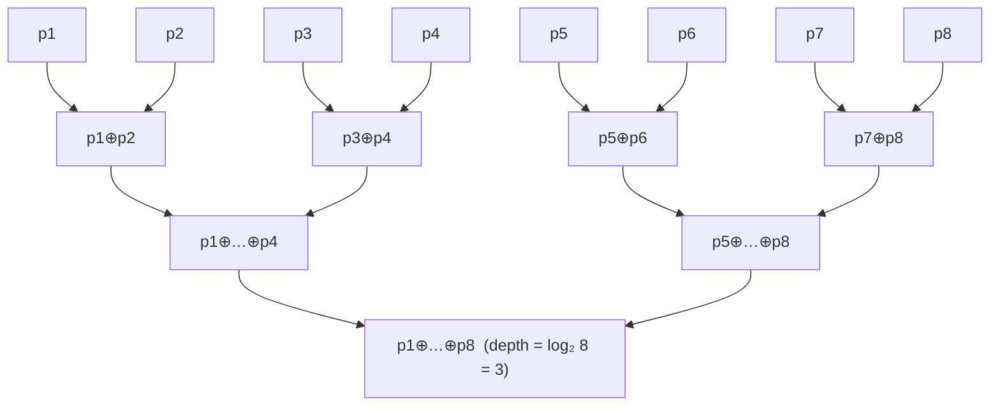

# 05 — The Hardware-Aware Algorithm: Parallel Scans, Fused Kernels, and Memory

## Overview

Mamba's selective state-space model (SSM) is, at its core, a *first-order linear
recurrence* run over the sequence axis:

```math
h_t = \bar{A}_t \odot h_{t-1} + \bar{B}_t \odot u_t, \qquad
y_t = \langle C_t, h_t \rangle + D\,u_t .
```

This says each hidden state is the previous state scaled element-wise by the
discrete transition `Ā_t` plus an input-driven term, and each output is a
projection of the state plus a skip connection.

A naive transcription is a Python `for` loop — exactly what `selective_scan_naive`
in [`mamba/ops/selective_scan_naive.py`](../mamba/ops/selective_scan_naive.py)
does. It is correct but has `O(L)` sequential *depth*: timestep `t` cannot start
until `t-1` finishes, so a GPU with thousands of cores sits mostly idle. The
*hardware-aware* algorithm breaks this dependency chain with a **parallel
associative scan**, then makes that scan **memory-frugal** so it does not drown
in HBM traffic — the same lesson FlashAttention taught for attention
[Dao et al., 2022].

This document explains, from scratch, why materializing the full state is the
real bottleneck, the math of the parallel prefix scan (Blelloch and
Hillis–Steele), how a fused kernel recomputes instead of stores, the memory
asymptotics of each variant, and tiling, conceptual CUDA design, the PyTorch
fallback, and benchmarking. The associative scan itself lives in
[`mamba/ops/selective_scan_parallel.py`](../mamba/ops/selective_scan_parallel.py)
(`_make_scan_op`, `_parallel_prefix_scan`, `selective_scan_parallel`), with shared
discretization/projection helpers in
[`mamba/ops/_scan_common.py`](../mamba/ops/_scan_common.py)
(`prepare_scan_inputs`, `project_output`).

### The memory bottleneck

Let `B` = batch, `L` = sequence length, `D` = `d_inner` channels, `N` =
`d_state`. Because `A` is **diagonal**, every `(b, d)` pair evolves as an
independent single-input/single-output recurrence over an `N`-vector state — so
the full state at one timestep is `(B, D, N)` and the full *trajectory* of all
states is `(B, L, D, N)`.

The pure-PyTorch parallel scan cannot stream: to expose all the parallelism it
vectorizes over every axis at once and therefore **materializes the entire
`(B, L, D, N)` state tensor** in HBM (`_parallel_prefix_scan` returns `states` of
exactly that shape). The cost is:

```math
M_{\text{parallel}} = \Theta(B\,L\,D\,N).
```

This says peak memory of the pure parallel scan grows with the product of *all
four* dimensions, including the length `L`.

A streaming recurrent reference only ever needs the *current* state
`h ∈ (B, D, N)`; it can emit `y_t` and discard `h_{t-1}`:

```math
M_{\text{recurrent}} = \Theta(B\,D\,N),
```

which says the active state of the recurrence is independent of `L` — the loop in
`selective_scan_naive` keeps exactly one such `h` alive (it stacks states only as
a convenience for the shared `project_output`).

For long-context training (`L` in the tens of thousands) the extra `L` factor is
decisive: a model that fits comfortably as a recurrence OOMs as a materialized
scan. The hardware-aware algorithm keeps the scan's *parallelism* while paying
only the `O(B D N)` *active memory* of the recurrence — the depth-vs-memory
tension is the through-line of this doc.

---

## Mathematical Background

### Parallel prefix scan (Blelloch scan)

A **prefix scan** (a.k.a. *scan*) over a sequence `x_1, …, x_L` with an
associative binary operator `⊕` produces the running aggregates

```math
s_t = x_1 \oplus x_2 \oplus \cdots \oplus x_t, \qquad t = 1, \dots, L,
```

which says output position `t` is the combination of all inputs up to and
including `t` (an *inclusive* scan). Computed naively this is `O(L)` sequential
work along a chain; the magic of associativity is that the chain can be
*re-parenthesized* into a balanced tree of depth `O(log L)`.

#### Casting the SSM recurrence as a scan

Each timestep applies an **affine map** to the state:

```math
f_t(h) = a_t\,h + b_t, \qquad a_t = \bar{A}_t,\quad b_t = \bar{B}_t\,u_t,
```

which says "scale by `a_t`, then add `b_t`"; `a_t` and `b_t` are precisely the
`A_bar` and `deltaB_u` tensors returned by `prepare_scan_inputs`. With `h_0 = 0`
the state `h_t` is the composition `f_t ∘ … ∘ f_1` at `0`, and representing each
map by its pair `(a, b)`, composition becomes the operator in `_make_scan_op`:

```math
(a_1, b_1) \oplus (a_2, b_2) = (a_2 a_1,\; a_2 b_1 + b_2),
```

which says "apply the left (earlier) map, then the right (later) map": the new
multiplier is the product of multipliers and the new offset pushes the left offset
through the right map and adds the right offset; the identity is `(1, 0)` (the map
`h ↦ h`). Consequently the inclusive scan of `(a_t, b_t)` carries the cumulative
product in its first slot and **exactly the hidden state `h_t`** in its second —
which is why `selective_scan_parallel` reads off
`_, states = _parallel_prefix_scan(A_bar, deltaB_u)` and discards the multiplier.

#### Associativity proof

Associativity is what licenses the log-depth re-parenthesization, so it must be
proved, not assumed. Let `p_i = (a_i, b_i)`. Compute both groupings of
`p_1 ⊕ p_2 ⊕ p_3`.

Left grouping `(p_1 ⊕ p_2) ⊕ p_3`:

```math
(p_1\oplus p_2)\oplus p_3 = (a_2 a_1,\; a_2 b_1 + b_2)\oplus(a_3,b_3)
= \big(a_3 a_2 a_1,\; a_3(a_2 b_1 + b_2) + b_3\big),
```

which expands to multiplier `a_3 a_2 a_1` and offset `a_3 a_2 b_1 + a_3 b_2 + b_3`.

Right grouping `p_1 ⊕ (p_2 ⊕ p_3)`:

```math
p_1\oplus(p_2\oplus p_3) = (a_1,b_1)\oplus(a_3 a_2,\; a_3 b_2 + b_3)
= \big((a_3 a_2)a_1,\; (a_3 a_2)b_1 + (a_3 b_2 + b_3)\big),
```

which gives multiplier `a_3 a_2 a_1` and offset `a_3 a_2 b_1 + a_3 b_2 + b_3` —
**identical to the left grouping**, so `⊕` is associative.

Identity (two-sided):

```math
(1,0)\oplus(a,b) = (a\cdot 1,\; a\cdot 0 + b) = (a,b), \qquad
(a,b)\oplus(1,0) = (1\cdot a,\; 1\cdot b + 0) = (a,b),
```

which says padding with `(1, 0)` on either side leaves a map unchanged — exactly
the property exploited when the scan shifts and pads. Both facts are pinned down
in
[`tests/unit/test_selective_scan.py::TestScanAssociativity`](../tests/unit/test_selective_scan.py)
(`test_operator_is_associative`, `test_identity_element`).

#### Blelloch (work-efficient) up-sweep / down-sweep

The classic **work-efficient** scan [Blelloch, 1990] runs two passes over a
balanced binary tree.

*Up-sweep (reduce).* Walk the tree from leaves to root, combining pairs:

```math
x[i] \leftarrow x[i - 2^{d-1}] \oplus x[i] \quad\text{at level } d=1,\dots,\log_2 L,
```

which says each internal node stores the `⊕`-reduction of its subtree; after this
pass the root holds the total `x_1 ⊕ … ⊕ x_L`. Total work is `O(L)` combines
(the tree has `L-1` internal nodes), with depth `O(log L)`.

*Down-sweep.* Set the root to the identity `(1, 0)`, then walk back down: each
node passes the parent's value to its *left* child and the `⊕` of the parent with
the stored left value to its *right* child, producing the **exclusive** prefix
(one shift converts it to inclusive). Blelloch is `O(L)` work (optimal) at
`O(log L)` depth; its cost is irregular strided access (the `2^{d-1}` strides) and
a down-sweep scatter — fine in a hand-written CUDA kernel, awkward to vectorize in
pure PyTorch.

#### Hillis–Steele (the variant actually implemented)

`_parallel_prefix_scan` instead implements the **Hillis–Steele** inclusive scan
[Hillis & Steele, 1986], which trades extra work for a perfectly regular,
fully-data-parallel shape. At round `k` the stride is `shift = 2^k`, and every
position combines with the partial result `shift` positions to its left:

```math
s_t^{(k)} = s_{t-2^{k}}^{(k-1)} \oplus s_t^{(k-1)},
\qquad k = 0, 1, \dots, \lceil \log_2 L\rceil - 1,
```

which says at each round a position absorbs a partial result twice as far away as
the previous round, so the reach doubles until it covers the whole prefix. The
first `shift` positions have no left neighbor and are padded with the identity
`(1, 0)` — in code, `a_prev` is padded with `torch.ones_like(...)` and `b_prev`
with `torch.zeros_like(...)`. The combine is the operator above, written so the
offset is updated *before* the multiplier is overwritten:

```text
b_cum = a_cum * b_prev + b_cum   # a_right * b_left + b_right
a_cum = a_cum * a_prev           # a_right * a_left
```

Here the "current" element plays the role of the *right* (later) operand and the
shifted partial the *left* (earlier) operand, matching
`op(prev, cur)` from `_make_scan_op`. The complexity, per the function's
docstring, is:

```math
\text{depth} = O(\log L), \qquad \text{work} = O(L \log L),
```

which says Hillis–Steele reaches the answer in logarithmically few rounds but
does a `log L` factor more combines than Blelloch — *not* work-efficient. The
payoff: every round is a uniform `mul`/`add`/`cat` over the whole tensor, so
autograd yields exact gradients with no custom backward (verified by `gradcheck`),
and because shift-and-combine is well defined at every length, **non-power-of-two
`L` needs no padding** (tested at `L ∈ {3, 7, 17, 100, 1000}` in
`TestParallelScan`). The deliberate trade is vectorizability and exact autograd
over minimal FLOPs — `_parallel_prefix_scan`'s docstring is the precise reference
(the module docstring's "work-efficient" wording is loose).

#### Tree-reduction diagram

The balanced reduction tree below (the Blelloch up-sweep, and the conceptual
skeleton Hillis–Steele fills out in parallel) shows why depth is `log₂ L`. For
`L = 8`:



Each level halves the number of live aggregates, so 8 inputs collapse in 3
levels; in a full scan every prefix `s_t` is read off from the partial
aggregates, not just the root.

### Memory complexity analysis

Treating the `D` channels as independent SISO recurrences (true because `A` is
diagonal) lets us separate the *active working set* from the *materialized
trajectory*. Define `B, L, D, N` as above.

| Variant | Peak / active memory | Why |
| --- | --- | --- |
| Recurrent reference (true streaming) | `O(B·D·N)` | only the running `h` is alive (`selective_scan_naive`'s loop variable) |
| Naive state-only, per resident channel | `O(B·L·N)` | if `D` is the parallel/grid axis, one channel's *state history* over `L` is `(B, L, N)` |
| Pure-PyTorch parallel scan | `O(B·L·D·N)` | `_parallel_prefix_scan` materializes every state for autograd |
| Fused (recompute) kernel | `O(B·D·N)` | stores inputs + final state, recomputes the trajectory in backward |

```math
\underbrace{O(B D N)}_{\text{fused / streaming}}
\;\ll\;
\underbrace{O(B L N)}_{\text{state-only, per channel}}
\;\ll\;
\underbrace{O(B L D N)}_{\text{pure parallel}} .
```

This ordering says the parallel scan's memory exceeds the streaming variants by
the full `L` (and `D`) factor — exactly the gap a fused kernel closes. The
compute asymptotics are complementary: the parallel scan does `O(B L D N · log L)`
work at `O(log L)` depth versus the recurrence's `O(B L D N)` work at `O(L)`
depth — same work up to `log L`, drastically different parallel depth.

---

## Implementation Notes

### The fused kernel strategy: recompute, don't store

FlashAttention's central trick [Dao et al., 2022] is *recomputation*: never write
the large intermediate (the attention matrix) to HBM, but recompute it in tiles
during the backward pass from inputs that *are* in HBM. The selective scan applies
the same idea. The pure-PyTorch scan keeps the entire `(B, L, D, N)` `states`
tensor alive because autograd needs it for the backward graph. A **fused kernel**
instead, in the **forward**, streams the scan through on-chip memory and writes
only `y` (and optionally the final state) to HBM; in the **backward** it
**recomputes** the forward states tile-by-tile (the scan is cheap, `O(1)`
FLOPs/byte) and immediately consumes them for gradients — never materializing
`(B, L, D, N)`.

The result is `O(B·D·N)` active memory with the scan's parallelism intact. In
*pure PyTorch*, `torch.utils.checkpoint.checkpoint` (flagged in the
`selective_scan_parallel.py` docstring) exposes the same trade-off cheaply: wrap
the scan, drop its saved tensors, and let PyTorch recompute the forward during
backward — `O(L)`-friendly memory at the price of one extra forward, the poor
man's fused kernel.

### Tiling strategy: chunked / segmented scan across SRAM blocks

A real GPU kernel cannot hold an `L`-long sequence in registers or shared memory,
so it **partitions `L` into chunks** of size `C` (e.g. 64–256) that fit in
SRAM, and runs a three-stage *segmented* scan:

1. **Intra-chunk scan.** Load chunk `j`'s `(a, b)` tile into shared memory and run
   a local inclusive scan `local_t = p_{jC+1} ⊕ … ⊕ p_t` *as if the chunk started
   from identity*, retaining the chunk's total aggregate
   `R_j = local_{(j+1)C} = p_{jC+1} ⊕ … ⊕ p_{(j+1)C}` — one affine map that
   summarizes the whole chunk.

2. **Inter-chunk scan (carries).** Scan the small array of chunk aggregates
   `R_0, R_1, …` to get the *carry-in* prefix for each chunk:

```math
\text{carry}_j = R_0 \oplus R_1 \oplus \cdots \oplus R_{j-1},
```

   which says chunk `j`'s carry-in is the composition of all earlier chunks'
   aggregates — a tiny scan of length `⌈L/C⌉`.

3. **Apply carries.** Recombine: `s_t = carry_j ⊕ local_t` for every `t` in
   chunk `j`, giving the global inclusive scan.

Chunk size `C` is chosen so the resident tile `(C × N)` per channel fits in
shared memory and keeps registers within budget; `B` and `D` (or channel blocks)
map to the CUDA grid so thousands of independent scans run concurrently. This is
the same hierarchical decomposition used by the official Mamba CUDA kernel and by
GPU scan libraries [Harris et al., 2007].

### CUDA kernel design (conceptual)

- **Warp-level scan primitives.** Within a 32-lane warp the intra-chunk scan uses
  `__shfl_up_sync` shuffles to combine each lane with the lane `2^k` below it —
  Hillis–Steele in registers with zero shared-memory traffic, completing in
  `log₂ 32 = 5` rounds.
- **Shared memory.** Per-warp aggregates are written to shared memory, scanned at
  block level (one warp scans the warp-totals), and broadcast back as carry-ins —
  the stage-1/stage-2 split of the tiling scheme, kept entirely on-chip.
- **Register pressure.** Each thread owns the `N`-vector state for its `(b, d)`
  slice. With small `N` (Mamba uses `d_state = 16`) the `(a, b)` pair fits in
  registers; chunk size `C` is balanced against register count to keep occupancy
  high, since spilling to local memory destroys the bandwidth advantage.
- **Precision & IO-awareness.** `a, b` accumulate in fp32 even under fp16/bf16
  graphs (`project_output` casts back), since long products of `Ā_t` are
  rounding-sensitive; inputs are read coalesced once, the trajectory is never
  written, and the backward recomputes from the same reads — the kernel is
  *memory-bound*, so cutting HBM round-trips is the whole game.

### PyTorch fallback: `use_fast_path`

The selective SSM chooses its scan at runtime in
[`mamba/core/selective_ssm.py`](../mamba/core/selective_ssm.py):

```python
scan = selective_scan_parallel if self.use_fast_path else selective_scan_naive
```

`use_fast_path` defaults to `True` in
[`mamba/config.py`](../mamba/config.py) (`use_fast_path: bool = True`). In this
repository **both paths are pure PyTorch**, so the toggle picks:

- **Fast path** (`True`) → `selective_scan_parallel`, the log-depth scan: use it
  for training and prefill on GPU, where parallel depth dominates wall-clock and
  the `O(B L D N)` memory is affordable (or wrapped in `checkpoint`).
- **Slow path** (`False`) → `selective_scan_naive`, the `O(L)`-depth reference:
  the correctness ground truth (parallel must match it to `atol=1e-4`), and the
  choice for gradient debugging, CPU, tiny `L`, or when the trajectory would OOM.

`use_fast_path=True` is also the natural hook to route to a *compiled/CUDA* kernel
(the fused recompute kernel above, or `torch.compile`) while `False` keeps the
readable reference. Single-step decoding (`L = 1`) uses a separate recurrent path
(`_forward_recurrent`), `O(1)` per step regardless of this flag.

### Benchmarking methodology

Benchmarks live in
[`tests/benchmark/bench_selective_scan.py`](../tests/benchmark/bench_selective_scan.py)
(pytest-benchmark, `group="scan"`, marked `slow`, run with
`pytest tests/benchmark/ -m slow --benchmark-only`). They sweep
`seqlen ∈ {128, 512, 2048, 8192}` and `torch.cuda.synchronize()` before stopping
the timer so async GPU work is fully counted.

**Latency & peak memory.** Compare naive vs. parallel median wall-clock vs. `L`
(the parallel scan wins as `L` grows, depth `log L` vs `L`, until its
`O(B L D N)` traffic limits it). For memory, wrap a single call in
`torch.cuda.reset_peak_memory_stats()` / `torch.cuda.max_memory_allocated()` — the
pattern in `TestParallelScan::test_memory_usage_linear_in_L`, which asserts memory
grows *linearly* (≈4×) not quadratically (≈16×) when `L` quadruples.

**Memory-bandwidth utilization.** The scan is bandwidth-bound (arithmetic
intensity is `O(1)` FLOP/byte). Estimate bytes moved — reads of `A_bar`,
`deltaB_u` (`≈ B·L·D·N` elements each), `C` (`B·L·N`), plus the `states`/`y`
writes — and divide by median time to get achieved GB/s, then compare to the
device's peak HBM bandwidth:

```math
\text{BW}_{\text{achieved}} = \frac{\text{bytes read} + \text{bytes written}}{t_{\text{median}}},
\qquad
\eta_{\text{BW}} = \frac{\text{BW}_{\text{achieved}}}{\text{BW}_{\text{peak}}} ,
```

which says bandwidth efficiency is the fraction of the GPU's peak HBM throughput
the kernel actually attains — the headline number for a memory-bound op, and the
metric a fused recompute kernel improves by *eliminating* the trajectory
read/write.

**FLOP efficiency.** Count combines (`≈ 3` FLOPs each: two multiplies, one add)
over `B·D·N` elements and `O(L log L)` rounds, divide by time for achieved
FLOP/s, and compare to peak:

```math
\eta_{\text{FLOP}} = \frac{\text{FLOPs}}{t_{\text{median}}\cdot \text{FLOP}_{\text{peak}}} .
```

This says FLOP efficiency measures compute utilization; for this op it will be
*low*, confirming via the roofline model that the kernel is memory- not
compute-bound. Always warm up, take the median over many runs, fix GPU clocks,
and exclude one-time compilation.

> All concrete throughput/latency figures must come from running the suite on
> your own hardware; any numbers in prose here would be *illustrative only*. This
> document states asymptotics and methodology, not measured results.

---

## Common Pitfalls

- **Padding with the wrong identity.** When shifting, `a` must be padded with `1`
  and `b` with `0` (the identity `(1, 0)`); padding `a` with `0` zeros the prefix
  product and corrupts every downstream state. `_parallel_prefix_scan` uses
  `ones_like` / `zeros_like` precisely for this.
- **Update ordering.** Compute the offset *before* overwriting the multiplier
  (`b_cum = a_cum*b_prev + b_cum` *then* `a_cum = a_cum*a_prev`). Swapping the
  lines uses the already-updated multiplier and is wrong.
- **Operator orientation.** `⊕` is **non-commutative**: keep "earlier = left,
  later = right"; swapping operands breaks the scan.
- **Non-power-of-two lengths.** Hillis–Steele handles any `L` with no padding
  (tested at `L = 3, 7, 17, 100, 1000`); Blelloch must pad to a power of two and
  trim, or it silently mis-scans the tail.
- **Numerical range.** Long products of `Ā_t` (`|Ā|<1` for stable `A`) underflow
  toward zero; accumulate in fp32 (`project_output` casts back at the end), and
  consider log-space accumulation in a kernel for extreme `L`.
- **Forgetting the memory cost.** The `O(B L D N)` trajectory is easy to overlook
  until it OOMs; reach for `torch.utils.checkpoint` or a fused recompute kernel
  before scaling `L`.
- **Backward must match forward.** The pure-PyTorch scan gets exact gradients for
  free (built only from `mul`/`add`/`cat`, `gradcheck` passes); a custom CUDA
  backward that recomputes states must stay close enough to keep
  `test_gradients_match_naive` green. (Complex states take the real part in
  `project_output`; a kernel must do the same.)

---

## References

- **[Blelloch, 1990]** G. E. Blelloch. *Prefix Sums and Their Applications.*
  Technical Report CMU-CS-90-190, Carnegie Mellon University. — The work-efficient
  up-sweep/down-sweep scan.
- **[Hillis & Steele, 1986]** W. D. Hillis and G. L. Steele Jr. *Data Parallel
  Algorithms.* Communications of the ACM, 29(12). — The log-depth, work-inefficient
  scan implemented in `_parallel_prefix_scan`.
- **[Harris et al., 2007]** M. Harris, S. Sengupta, J. D. Owens. *Parallel Prefix
  Sum (Scan) with CUDA.* GPU Gems 3, Ch. 39. — Warp/block tiling and shared-memory
  scan on GPUs.
- **[Dao et al., 2022]** T. Dao, D. Y. Fu, S. Ermon, A. Rudra, C. Ré.
  *FlashAttention: Fast and Memory-Efficient Exact Attention with IO-Awareness.*
  NeurIPS 2022. — Recompute-in-backward / IO-aware fused kernels.
- **[Gu & Dao, 2023]** A. Gu and T. Dao. *Mamba: Linear-Time Sequence Modeling
  with Selective State Spaces.* — The selective scan (Algorithm 2) and its
  hardware-aware implementation.
- **[Smith et al., 2023]** J. T. H. Smith, A. Warrington, S. W. Linderman.
  *Simplified State Space Layers for Sequence Modeling (S5).* ICLR 2023. —
  Popularized the parallel associative scan for linear SSMs.
