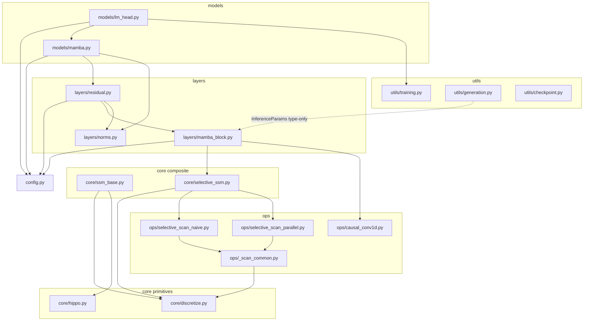

# 06 — Implementation Guide: Mamba From Scratch

## Overview

This guide is the map for the `mamba/` package: a pure-PyTorch, dependency-free
implementation of the Mamba selective state space model of
[Gu & Dao, 2023], built up from its mathematical antecedents — HiPPO
[Gu et al., 2020] and S4 [Gu et al., 2021]. There are no compiled CUDA kernels
and no `mamba_ssm` dependency; every operator is expressed in `mul`/`add`/`cat`
so that ordinary autograd produces exact gradients.

The codebase is organised in four conceptual layers — **ops → core → layers →
models** — plus a `utils/` band for training, generation, and checkpointing.
The package root (`/home/somu/build-your-own-ssm/mamba/__init__.py`) exposes a
deliberately small public surface and resolves the heavy symbols lazily via
`__getattr__` (PEP 562) so that `import mamba` stays cheap and cycle-free:

```python
from mamba import MambaConfig, MambaModel, MambaLMHeadModel, MambaBlock, SelectiveSSM, load_pretrained
```

Tooling (from `/home/somu/build-your-own-ssm/pyproject.toml`): Python ≥ 3.10,
`torch>=2.0`, `numpy>=1.24`; dev extras pin `pytest`, `pytest-benchmark`,
`hypothesis`, `scipy`, `black` (line length 88), and `mypy` in `strict` mode.
Tests live under `tests/` and run with `-v --tb=short`.

---

## 1. Repository Layout

Every module below carries a module-level docstring; the path and the public
identifiers are exact.

### Configuration
- **`mamba/config.py`** — `MambaConfig`, a `@dataclass` holding every
  hyperparameter. `__post_init__` validates inputs and computes the derived
  `d_inner = expand * d_model` and resolves `dt_rank="auto"`. Properties
  `padded_vocab_size` and `dt_rank_int` expose the rounded vocab and the
  concrete integer rank. See §5.

### `core/` — the SSM mathematics
- **`core/discretize.py`** — turns a continuous-time ODE into a discrete
  recurrence. Public functions: `zoh`, `bilinear`, `euler`, `selective_zoh`,
  and the numerically stable helper `phi` (φ(x) = (eˣ−1)/x). `selective_zoh` is
  the batched, diagonal, input-dependent ZOH at the heart of S6.
- **`core/hippo.py`** — HiPPO initialization matrices. `hippo_legs`,
  `hippo_legt`, `hippo_lagt` (the three classical measures); `make_nplr_hippo`
  (Normal-Plus-Low-Rank factorization of LegS); `make_dplr_hippo` (the complex
  Diagonal-Plus-Low-Rank form S4 trains); `random_ssm_init` (the multi-channel
  diagonal init Mamba actually uses, S4D-real for real dtypes).
- **`core/ssm_base.py`** — `SSMBase` (abstract base fixing the
  recurrent/convolutional duality) and `ContinuousSSM`, a single-channel LTI S4
  model that discretizes on the fly and switches modes via `set_training_mode`.
  This is the pedagogical stepping-stone before selection.
- **`core/selective_ssm.py`** — `SelectiveSSM`, the S6 layer. Makes `Δ, B, C`
  input-dependent (`x_proj`, `dt_proj`), keeps `A = -exp(A_log)` static and
  diagonal, and exposes `forward` (parallel/prefill), `step` (O(1) decode), and
  `allocate_inference_cache`.

### `ops/` — the scan and convolution kernels
- **`ops/_scan_common.py`** — shared pre/post-processing for both scans:
  `preprocess_delta` (bias + softplus), `prepare_scan_inputs` (calls
  `selective_zoh`, folds `u` into `B̄`), `project_output` (`y = ⟨C, h⟩ + Du`).
  Factoring this here is what *guarantees* the two scans agree.
- **`ops/selective_scan_naive.py`** — `selective_scan_naive`, the sequential
  O(L)-depth reference loop. Defines the ground-truth semantics.
- **`ops/selective_scan_parallel.py`** — `selective_scan_parallel`, the
  log-depth Hillis–Steele associative scan (`_make_scan_op`,
  `_parallel_prefix_scan`). Numerically equivalent to the naive scan.
- **`ops/causal_conv1d.py`** — `CausalConv1d`, a depthwise causal convolution
  with `forward` (full sequence), `step` (O(K) rolling buffer), and
  `allocate_inference_cache`.

### `layers/` — neural building blocks
- **`layers/norms.py`** — `RMSNorm` (root-mean-square norm, fp32 reduction) and
  a thin `LayerNorm` wrapper.
- **`layers/mamba_block.py`** — `MambaBlock`, the gated mixer:
  `in_proj → (conv → SiLU → SelectiveSSM) ⊙ SiLU(z) → out_proj`. Holds
  `forward`, `step`, and cache helpers. Norm-free by design (see §6).
- **`layers/residual.py`** — `ResidualBlock`, the pre-norm wrapper
  `y = x + Dropout(Block(Norm(x)))` around a `MambaBlock`.

### `models/` — assembled networks
- **`models/mamba.py`** — `MambaModel`, the backbone: token `Embedding` →
  `n_layers` `ResidualBlock`s → final `RMSNorm`. No positional encoding.
  Includes `allocate_inference_cache` and `from_pretrained`.
- **`models/lm_head.py`** — `MambaLMHeadModel` (backbone + weight-tied
  `lm_head`), `CausalLMOutput` (a `NamedTuple` of `logits, loss`), `generate`,
  and the `load_pretrained` helper.

### `utils/` — training and inference plumbing
- **`utils/generation.py`** — `InferenceParams` (the recurrent-state cache) and
  `generate` (greedy + temperature/top-k/top-p/repetition-penalty), plus
  `apply_repetition_penalty`, `top_k_filter`, `top_p_filter`.
- **`utils/training.py`** — `build_optimizer` (AdamW with decay/no-decay split),
  `build_scheduler` (warmup + cosine), `clip_grad_norm_`, `compute_loss`
  (shifted cross-entropy).
- **`utils/checkpoint.py`** — `save_checkpoint`, `load_checkpoint`, and
  `convert_from_reference` (renames official `mamba_ssm` keys into this layout).

---

## 2. Abstraction Layers and Dependency Graph

The conceptual layering is **ops → core → layers → models**, but the *actual*
import edges have one important subtlety worth stating precisely: `core/discretize.py`
is a leaf primitive that the `ops/` scans build on (`prepare_scan_inputs` calls
`selective_zoh`), while the composite `core/selective_ssm.py` then consumes those
scans. Because the primitive (`discretize`) and the composite (`selective_ssm`)
are *different* modules, there is no cycle. The session-scoped
`test_no_circular_imports` in `tests/conftest.py` walks every submodule with
`pkgutil.walk_packages` and imports it, failing if any cycle exists.



The dotted edge marks a `TYPE_CHECKING`-only reference: `MambaBlock`,
`ResidualBlock`, and the models import `InferenceParams` under
`if TYPE_CHECKING:` so the runtime graph stays acyclic. `utils/generation.py`
itself imports nothing from the model stack at runtime — `generate` receives the
model as an argument.

---

## 3. Build Order and Why

Each layer is testable in isolation and depends only on what precedes it. Build
(and read) the code in this order:

1. **`discretize`** — *Why first:* every SSM is defined in continuous time;
   nothing runs until you can convert `(A, B, Δ)` into a discrete `(Ā, B̄)`.
   `zoh` and `phi` are the foundation `selective_zoh` reuses.
2. **`hippo`** — *Why next:* a randomly-initialised `A` forgets the past
   immediately. HiPPO supplies the stable, memory-preserving initialization
   (`hippo_legs`, `random_ssm_init`) that makes training possible. It depends on
   nothing but `torch`.
3. **`ssm_base` / `ContinuousSSM`** — *Why:* combine discretize + HiPPO into a
   working *time-invariant* (S4-style) SSM and prove the recurrent and
   convolutional views agree. This is the conceptual rehearsal for S6.
4. **`selective_scan_*`** (via `_scan_common`) — *Why:* selection breaks the
   convolution trick, so you need the associative scan. Write the naive loop
   first as ground truth, then the parallel scan to match it.
5. **`SelectiveSSM`** — *Why:* now wrap the scans with the input-dependent
   projections (`x_proj`, `dt_proj`) and the static diagonal `A_log`. This is
   the S6 core.
6. **`MambaBlock`** — *Why:* add the gating, the causal conv, and the in/out
   projections around `SelectiveSSM`.
7. **`Mamba` model** (`ResidualBlock` → `MambaModel` → `MambaLMHeadModel`) —
   *Why last:* stack pre-norm residual blocks, add embedding/final-norm, and tie
   the LM head. Training and generation utilities sit on top.

---

## 4. Numerical Pitfalls and How They Are Handled

### Complex exponentials and stability of `A`
For the complex HiPPO init (`make_dplr_hippo`) the diagonal `Λ` has real part
exactly −½, guaranteeing `|exp(ΔΛ)| < 1`. For the real S4D init Mamba trains,
`SelectiveSSM` stores `A_log` and uses

```math
A = -\exp(A_{\log})
```

Plain-English: exponentiating and negating forces every diagonal entry strictly
negative, so the discrete factor `Ā = exp(ΔA)` always has magnitude below one and
the recurrence cannot blow up. `random_ssm_init` and `core/hippo.py` assert
`A.real < 0` before returning.

### The φ helper — avoiding 0/0 in the ZOH input matrix
The exact diagonal ZOH input factor is `B̄ = φ(ΔA)·Δ·B` where

```math
\varphi(x) = \frac{e^x - 1}{x}, \qquad \varphi(0) = 1
```

Plain-English: φ is the factor relating the exact ZOH `B̄` to the cheap Euler
`ΔB`. Evaluated naively it is `0/0` at `x = 0`, producing `NaN` values *and* `NaN`
gradients. `phi` in `core/discretize.py` guards this by using `expm1(x)/x` away
from zero and the truncated Taylor series `1 + x/2` for `|x| < eps`
(`torch.where` over a `small` mask, with a safe denominator). Mamba's reference
code approximates φ ≡ 1; keeping the exact factor here is what lets the recurrent
`step` and the parallel scan agree bit-for-bit.

### Log-space step-size initialization
`dt_proj`'s bias is set so `softplus(bias)` is log-uniform in `[dt_min, dt_max]`,
using the inverse-softplus identity

```math
b = d + \log(-\mathrm{expm1}(-d)), \qquad d = \Delta_{\text{target}}
```

Plain-English: instead of initialising Δ directly, the code initialises the
pre-activation bias so that after `softplus` the steps land in the desired range;
`expm1`/`log` keep this stable for the tiny Δ values (`dt_min = 0.001`).

### dtype casting: fp32 compute, original dtype out
Every numerically sensitive routine upcasts, computes, then casts back:

- `core/discretize.py` `_compute_dtype` promotes fp16/bf16/fp32 to **float32**
  (and keeps fp64/complex), so matrix exponentials and linear solves never run in
  half precision.
- `RMSNorm` reduces the sum-of-squares in float32 to avoid overflow when squaring
  bf16/fp16 activations, then casts back.
- The scan path (`prepare_scan_inputs` → `project_output`) computes in at least
  float32 and `project_output` ends with `y.to(u.dtype)`, so the surrounding
  fp16/bf16 graph is preserved. `project_output` and the recurrent step also take
  `y.real` when states are complex (the SSM output is real-valued).

This dtype discipline is exercised by the `dtype_cases` fixture
(`float32, float16, bfloat16`) in `tests/conftest.py` and the
`test_low_precision_forward` test.

---

## 5. The Config System (`MambaConfig`)

All defaults below are the literal values in `mamba/config.py`; they reproduce
`mamba-130m`.

| Field | Default | Meaning & sensitivity |
|---|---|---|
| `d_model` | `768` | Residual-stream width D. Primary capacity/throughput knob; everything scales with it. |
| `n_layers` | `24` | Number of stacked `ResidualBlock`s (depth). |
| `d_state` | `16` | SSM state dimension N. More history per channel; memory/compute scale linearly in N. Usually 16. |
| `d_conv` | `4` | Causal conv kernel width K (local context). Small by design; large values add latency in `step`. |
| `expand` | `2` | Inner expansion E; sets `d_inner = E·d_model`. Rarely changed. |
| `dt_rank` | `"auto"` | Rank of the low-rank Δ projection. `"auto"` → `ceil(d_model/16)` in `__post_init__`. |
| `dt_min` | `0.001` | Lower end of the log-uniform initial Δ range. |
| `dt_max` | `0.1` | Upper end of the initial Δ range. Must satisfy `dt_min < dt_max` (validated). |
| `dt_init` | `"random"` | `"random"` → uniform `dt_proj.weight` in ±`dt_scale·dt_rank^-0.5`; `"constant"` → that scale exactly. |
| `dt_scale` | `1.0` | Multiplier on the `dt_proj.weight` init scale. |
| `dt_init_floor` | `1e-4` | Lower clamp on initial Δ samples; prevents degenerate near-zero steps. |
| `conv_bias` | `True` | Whether `CausalConv1d` has a per-channel bias. |
| `bias` | `False` | Whether `in_proj`/`out_proj`/`x_proj` carry bias (paper uses `False`). |
| `use_fast_path` | `True` | `True` → parallel scan; `False` → naive scan. Both pure PyTorch (see §7). |
| `layer_idx` | `None` | Optional block index; keys the per-layer inference cache. |
| `vocab_size` | `50277` | Raw vocabulary size before padding. |
| `pad_vocab_size_multiple` | `8` | Vocab is rounded up to a multiple of this for a hardware-friendly head. |

**Derived fields.** `d_inner = expand * d_model` is set in `__post_init__`
(`field(init=False)`). `padded_vocab_size` (property) rounds `vocab_size` up to
`pad_vocab_size_multiple`. `dt_rank_int` (property) returns `dt_rank` as a
concrete `int` (raising if still unresolved). `__post_init__` rejects any
non-positive structural hyperparameter, `dt_min >= dt_max`, or an invalid
`dt_init`.

---

## 6. Inference Recipe: Parallel Training → Recurrent Decoding, No Accuracy Loss

Mamba's superpower is that the *same weights* run two ways: a parallel scan for
training/prefill and an O(1)-per-token recurrence for decoding. The two paths
share `selective_zoh` (with `L = 1` in the step path), so the discretization is
identical — this is exactly why decode matches scoring.

**The pieces.**
- **`InferenceParams`** (`utils/generation.py`): a dataclass holding
  `max_seqlen`, `max_batch_size`, `seqlen_offset`, and
  `key_value_memory_dict` mapping `layer_idx → (conv_state, ssm_state)`. The
  state shapes are independent of sequence length — decoding is constant-memory.
- **Per-layer state.** `MambaBlock.allocate_inference_cache` returns a
  `(batch, d_inner, d_conv)` conv buffer and a `(batch, d_inner, d_state)` SSM
  state.
- **`block.step`** (`layers/mamba_block.py`): one-token path —
  `in_proj → conv1d.step (rolling buffer) → SiLU → ssm.step → gate → out_proj`.
- **`SelectiveSSM.step`** uses `selective_zoh` then the single-step recurrence

```math
h_t = \bar{A}_t \odot h_{t-1} + \bar{B}_t\, u_t, \qquad y_t = \langle C_t, h_t\rangle + D\,u_t
```

Plain-English: multiply the previous state by the discrete decay, add the new
input contribution, then read out with `C` plus the skip `D`. Each `Ā, B̄` comes
from the very same `selective_zoh` the parallel scan uses.

**The prefill-then-decode flow** (`utils/generation.generate`):
1. Build `InferenceParams(max_seqlen=prompt_len+max_new_tokens, ...)`.
2. **Prefill:** call the model on the whole prompt with `inference_params`. With
   `seqlen_offset == 0`, each `MambaBlock.forward` runs the parallel scan with
   `return_last_state=True`, seeds the conv buffer from the trailing `d_conv`
   inputs, and stores `(conv_state, ssm_state)`. Take logits at the last
   position; set `seqlen_offset = prompt_len`.
3. **Decode:** feed one token at a time. With `seqlen_offset > 0` and `L == 1`,
   `MambaBlock.forward` routes through `step`, advancing the cached states in
   O(1).

**Why it is exact.** Because the block is norm-free (normalization lives in
`ResidualBlock`) and `step` reuses `selective_zoh`, `step` reproduces what
`forward` would compute for the same token and history. This is verified to
`atol=1e-4` by `test_inference_step_matches_forward`
(`tests/unit/test_mamba_block.py`), by `test_inference_state_does_not_grow`
(`tests/integration/test_generation.py`), and the two scans are cross-checked by
`test_naive_parallel_forward_equivalence` and
`test_naive_parallel_gradient_equivalence`
(`tests/property/test_scan_equivalence.py`).

---

## 7. Extension Points

### Swap in a CUDA selective scan (`use_fast_path`)
`SelectiveSSM._forward_parallel` selects the scan with one line:

```python
scan = selective_scan_parallel if self.use_fast_path else selective_scan_naive
```

Both scans share the signature
`(u, delta, A, B, C, D, delta_bias, delta_softplus, return_last_state)`. To plug
in a fused Triton/CUDA kernel, implement a drop-in with that signature and the
same `(Ā, B̄)` semantics (it must match the naive scan to `atol=1e-4`), then route
to it. The pure-PyTorch parallel scan materializes the full
`(batch, L, d_inner, d_state)` state (O(BLDN) memory); a fused kernel — or
wrapping the scan in `torch.utils.checkpoint` — recovers the O(BDN) memory of the
reference loop. The `cuda` extra in `pyproject.toml` (`triton`) is reserved for
exactly this.

### Add a new HiPPO variant
`core/hippo.py` already ships LegS, LegT, and LagT. To add a measure, write a
`hippo_<name>(n) -> (A, B)` returning float32 tensors with `Re(eig(A)) < 0`, then
either feed it through `make_nplr_hippo`/`make_dplr_hippo` for the diagonalised
form or wire it into `random_ssm_init` to produce the `(H, N)` per-channel init.
`SelectiveSSM.__init__` currently hard-codes the S4D-real spectrum
`A = -(1, …, N)` into `A_log`; point that initializer at your variant to change
the inductive bias. The reconstruction-quality fixture `legs_recon_mse`
(`tests/conftest.py`) is a template for validating a new measure.

### Support multi-dimensional inputs
The whole stack is already channel-parallel: `selective_zoh` runs one diagonal
system per channel (`A` is `(d_inner, d_state)`), and the scans operate over
`(batch, L, d_inner, d_state)`. To add an extra feature axis, fold it into
`d_inner` (so each sub-feature gets its own diagonal SSM) — the existing
`_validate_shapes` and broadcasting in `selective_zoh` carry through unchanged.
For genuinely multi-input/multi-output continuous SSMs, the general
`discretize.zoh`/`bilinear`/`euler` already accept `B` of shape `(..., N, M)`
and batched `delta`, so a non-diagonal extension builds on those.

---

## Common Pitfalls

- **Don't put the norm inside `MambaBlock`.** Pre-norm lives in `ResidualBlock`
  precisely so `forward` and `step` stay byte-identical. Moving it breaks
  step==forward equivalence.
- **Always softplus Δ before discretizing.** A negative Δ makes `exp(ΔA)`
  unstable. In the block, `_project` applies `F.softplus`; the scan-level
  `delta_softplus` flag is therefore passed as `False` from `SelectiveSSM`
  (softplus already applied) — passing it twice double-activates Δ.
- **Mind the dtype boundary.** Never run `matrix_exp`/`linalg.solve`/the scan in
  fp16/bf16 directly; rely on the fp32 upcast. Reading a complex state without
  `.real` leaks an imaginary part into a real output.
- **Conv buffer ordering.** `CausalConv1d.step` rolls left and writes the new
  sample to the last column; the buffer must hold the most recent `d_conv-1`
  inputs in order or the step output drifts from `forward`.
- **Weight tying.** `lm_head.weight` *is* `embedding.weight`; saving/loading must
  preserve that aliasing (the `state_dict` round-trips it correctly).
- **No positional encoding.** The SSM is inherently sequential; adding positions
  is redundant and untested.
- **`dt_rank` resolution.** Read it through `config.dt_rank_int`, never the raw
  `dt_rank` field (which may still be the string `"auto"` conceptually, though
  `__post_init__` resolves it in place).

---

## References

- **[Gu & Dao, 2023]** A. Gu and T. Dao. *Mamba: Linear-Time Sequence Modeling
  with Selective State Spaces.* 2023. — the selection mechanism (S6), the gated
  block (Fig. 3), the selective scan (Alg. 2), and parameter init (§3.6).
- **[Gu et al., 2021]** A. Gu, K. Goel, C. Ré. *Efficiently Modeling Long
  Sequences with Structured State Spaces (S4).* 2021. — discretization,
  recurrent/convolutional duality, and the NPLR/DPLR machinery.
- **[Gu et al., 2020]** A. Gu et al. *HiPPO: Recurrent Memory with Optimal
  Polynomial Projections.* 2020. — the HiPPO matrices used for initialization.
- **[Blelloch, 1990]** G. Blelloch. *Prefix Sums and Their Applications.* 1990. —
  the associative-scan foundation of `selective_scan_parallel`.
- **[Keskar et al., 2019]** N. Keskar et al. *CTRL.* 2019. — the repetition
  penalty used in `utils/generation.py`.
