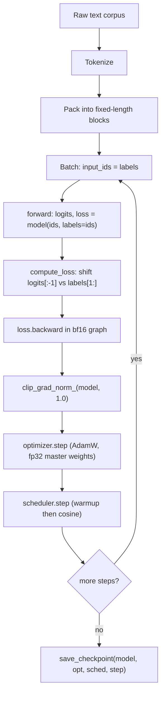
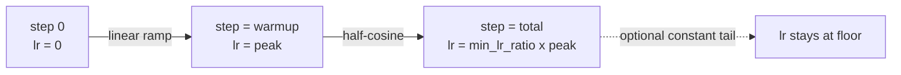

# 07 — Training and Evaluation

## Overview

This chapter covers how to *train* and *measure* the from-scratch Mamba in this
repository. The training recipe is deliberately the one from the original paper
[Gu & Dao, 2023]: AdamW with a decay / no-decay parameter split, a linear-warmup
then cosine-decay learning-rate schedule, global-norm gradient clipping, and a
causal language-modeling cross-entropy with a one-position shift. Every piece of
that recipe lives in `mamba/utils/training.py`, and an end-to-end loop wiring it
all together lives in `examples/train_lm.py`.

The relevant code surfaces are `mamba/utils/training.py` (`build_optimizer`,
`build_scheduler`, `clip_grad_norm_`, `compute_loss`), `examples/train_lm.py` (a
minimal, dependency-free loop on a synthetic copy task), `mamba/utils/checkpoint.py`
(`save_checkpoint`, `load_checkpoint`, `convert_from_reference`), and
`mamba/core/discretize.py` / `mamba/ops/_scan_common.py` (where the SSM upcasts to
`float32` for numerical safety).



## Mathematical Background

### The training objective

`compute_loss` (`mamba/utils/training.py`) implements next-token prediction.
Position `t` of the logits is trained to predict token `t+1`, so the loss shifts
the two tensors by one before computing cross-entropy:

```math
\mathcal{L} = -\frac{1}{|\mathcal{T}|}\sum_{t \in \mathcal{T}}
\log p_\theta\big(x_{t+1} \mid x_{\le t}\big),
\qquad
\mathcal{T} = \{\, t : x_{t+1} \neq \texttt{ignore\_index} \,\}
```

In words: the loss is the mean negative log-probability the model assigns to the
*actual next token*, averaged over every position whose target is not the ignore
index (`-100` by default). In code this is `shift_logits = logits[:, :-1, :]`
against `shift_labels = labels[:, 1:]`, fed to `F.cross_entropy(...,
ignore_index=ignore_index)`. The test `test_compute_loss_shift` pins it down:
uniform logits over a size-`V` vocabulary give exactly `log V`.

### The AdamW update

`build_optimizer` returns `torch.optim.AdamW`. AdamW *decouples* weight decay
from the gradient-based moment update [Loshchilov & Hutter, 2019]:

```math
\begin{aligned}
m_t &= \beta_1 m_{t-1} + (1-\beta_1)\, g_t, \\
v_t &= \beta_2 v_{t-1} + (1-\beta_2)\, g_t^2, \\
\theta_t &= \theta_{t-1} - \eta_t\Big(\frac{\hat m_t}{\sqrt{\hat v_t}+\epsilon}
            + \lambda\,\theta_{t-1}\Big).
\end{aligned}
```

The key idea: the `λ θ` decay term is applied *directly to the weights*, not
folded into the gradient, so it is not rescaled by the adaptive `1/√v`
denominator — which is why `weight_decay=0.1` behaves consistently across
parameters of very different gradient magnitudes.

### The learning-rate schedule

`build_scheduler` is a `LambdaLR` with two phases — linear warmup then cosine
decay to a floor:

```math
\eta_t = \eta_{\max}\cdot
\begin{cases}
\dfrac{t}{\,\text{warmup}\,} & t < \text{warmup}, \\[2ex]
r + (1-r)\cdot\dfrac{1}{2}\Big(1 + \cos\big(\pi\,p_t\big)\Big) & t \ge \text{warmup},
\end{cases}
\qquad
p_t = \frac{t-\text{warmup}}{\text{total}-\text{warmup}}.
```

Here `r = min_lr_ratio` (default `0.1`) is the floor as a fraction of peak, and
`p_t ∈ [0, 1]` is the fraction of the decay phase completed (clamped to `1`).
During warmup the multiplier rises linearly from `0` to `1`; afterwards it
follows a half-cosine from `1` down to `r`. The test
`test_scheduler_warmup_then_decay` confirms the multiplier increases through
warmup, hits the peak exactly at the end of warmup, and decays toward zero.

## Dataset Preprocessing

A real language-model run replaces `synthetic_batch` in `examples/train_lm.py`
with a tokenized corpus. The preprocessing pipeline has three stages.

**1. Tokenization.** Map raw text to integer ids with a fixed vocabulary. The
reference Mamba models use the GPT-NeoX BPE tokenizer, which is why
`MambaConfig.vocab_size` defaults to `50277`. `padded_vocab_size` then rounds this
up to a multiple of `pad_vocab_size_multiple` (default `8`) so the embedding /
output matrices have a hardware-friendly shape (`50277 → 50280`). The tokenizer is
*not* shipped here (this is a from-scratch *model* build); plug in any
BPE/SentencePiece tokenizer emitting ids in `[0, vocab_size)`.

**2. Packing sequences.** Documents are concatenated into one long token stream
and chopped into fixed-length blocks of `L` tokens, separated by an
end-of-document token. Packing avoids wasting compute padding short documents to
`L`. For each block, `input_ids` and `labels` are the *same* tensor — the
one-position shift in `compute_loss` turns it into the training signal, exactly as
`train_lm.py` does (`model(batch, labels=batch)`).

**3. Attention-free batching.** A Transformer needs an attention mask so tokens
cannot attend across packed-document boundaries. Mamba has **no attention and no
mask**: the recurrence is strictly causal by construction (`test_causal_property`
verifies outputs up to time `t0` are unchanged when inputs after `t0` are
perturbed), so a batch is just a dense `(batch, L)` integer tensor. There is also
**no positional encoding** to add (`mamba/models/mamba.py`) — the SSM is
inherently sequential. The only padding concern is at the *labels*: set padded
positions to `ignore_index` (`-100`) to skip them, rarely needed with packing.

## Optimizer Settings

`build_optimizer(model, lr=1e-3, weight_decay=0.1, betas=(0.9, 0.95), eps=1e-8)`
encodes the paper's AdamW configuration:

| Setting | Value | Source |
| --- | --- | --- |
| Optimizer | AdamW (decoupled decay) | [Loshchilov & Hutter, 2019] |
| `betas` | `(0.9, 0.95)` | [Gu & Dao, 2023] (β₂=0.95, GPT-3-style) |
| `weight_decay` | `0.1` | [Gu & Dao, 2023] |
| `eps` | `1e-8` | default |
| Grad clip (global norm) | `1.0` | [Gu & Dao, 2023] |

**The decay / no-decay split.** `build_optimizer` walks `model.named_parameters()`
and routes each parameter into one of two groups using the helper `_is_no_decay`:

```python
def _is_no_decay(name, param):
    return param.ndim < 2 or name.endswith("A_log") or name.endswith(".D")
```

Three categories land in the **no-decay** group (`weight_decay=0.0`):

1. **All 1-D parameters** — biases and RMSNorm gains; decaying them toward zero
   has no regularizing benefit.
2. **`A_log`** — the SSM state-matrix parameter (`A = -exp(A_log)` in
   `mamba/core/selective_ssm.py`). Decaying it would pull the state-space
   timescales toward a data-independent fixed point and break the HiPPO-style
   init.
3. **`D`** — the per-channel skip connection, a learned residual gain closer to a
   bias than to a weight matrix.

Everything else — the `≥ 2-D` matrices (`in_proj`, `out_proj`, `x_proj`,
`dt_proj.weight`, conv weight, embedding) — goes into the **decay** group, as
asserted by `test_optimizer_decay_split`.

**Gradient clipping.** Before each `optimizer.step()`, `clip_grad_norm_(model,
max_norm)` rescales all gradients so their *global* L2 norm does not exceed
`max_norm`, and returns the pre-clip norm for logging. It is a thin wrapper over
`torch.nn.utils.clip_grad_norm_`. `train_lm.py` uses `max_norm=1.0`, the paper's
value, and prints `|g|` each logging step. `test_clip_grad_norm` checks that the
post-clip norm is `≤ max_norm` (within tolerance).

## Learning Rate Schedule

`build_scheduler(optimizer, warmup_steps, total_steps, min_lr_ratio=0.1)` builds
the warmup-then-cosine schedule described in the Mathematical Background. The
three phases:



- **Warmup** (`step < warmup_steps`): linear ramp `step / warmup_steps` from 0 to
  peak, preventing early high-variance gradients from blowing up the moments.
- **Cosine decay** (`step ≥ warmup_steps`): half-cosine from peak down to
  `min_lr_ratio × peak`, the de-facto LM default.
- **Floor**: `progress` is clamped to `1.0`, so past `total_steps` the multiplier rests at `min_lr_ratio` (not negative).

**Why SSMs tolerate a higher LR than Transformers.** The `build_scheduler`
docstring notes that "SSMs tolerate larger learning rates than Transformers, so
the peak LR passed to `build_optimizer` is typically higher." Empirically
[Gu & Dao, 2023] train Mamba with peak LRs several times the GPT-3 schedule a
same-size Transformer would use; `train_lm.py` reflects this with `lr=3e-3`
(≈ 3× a typical Transformer peak) and only `warmup_steps=20` of `300`. Two
reasons: (1) **no softmax attention** — there are no query/key projections to
saturate, and Mamba's mixing is a bounded linear recurrence with a *stable*
state matrix `A = -exp(A_log) < 0`, so dynamics stay contracting under larger
steps; (2) the **SSM-specific parameters** (`A_log`, `D`, the `dt_proj` bias) are
excluded from decay and initialized to sensible timescales, letting the optimizer
take larger, steadier steps on the matrix weights.

## Mixed Precision Training

The standard recipe for training Mamba at scale is **bf16 autocast with fp32
master weights**:

- **bf16 forward / backward.** Wrap the forward in
  `torch.autocast(device_type="cuda", dtype=torch.bfloat16)`. bfloat16 keeps the
  full fp32 exponent range (only the mantissa is truncated), so it rarely
  over/underflows and — unlike fp16 — usually needs **no gradient-loss scaler**.
- **fp32 master weights.** With autocast the module parameters and optimizer
  state (`m`, `v`) stay fp32 while activations are cast to bf16 on the fly; AdamW
  updates the fp32 master copy, preserving small-update precision.

**How the SSM keeps itself safe.** The numerically delicate part of Mamba — the
discretization and the scan — *internally upcasts to `float32` regardless of the
caller's dtype*, then casts back, in two places:

- `mamba/core/discretize.py`: `_compute_dtype` promotes `float16`/`bfloat16` to
  `float32` (and complex to `complex64/128`) before any `matrix_exp`, `solve`, or
  `exp`/`expm1`; `selective_zoh` computes `A_bar = exp(Δ⊙A)` and `B_bar = φ(ΔA)·Δ·B`
  in that promoted dtype.
- `mamba/ops/_scan_common.py`: `project_output` does the einsum and skip-add in
  the (≥ fp32) scan dtype and only at the end does `y.to(u.dtype)` — "the scan
  computes in (at least) float32 for stability; hand the result back in the
  caller's dtype so the surrounding fp16/bf16 graph is intact."

So the surrounding block can run in bf16 (`test_low_precision_forward` checks the
forward is finite in both fp16 and bf16) while the precision-critical part — the
exponentials of the state matrix — is always done in fp32.

## Gradient Checkpointing

The parallel selective scan materializes the full `(batch, L, d_inner, d_state)`
state tensor, costing `O(B·L·D·N)` activation memory (see the note in
`mamba/ops/selective_scan_parallel.py`), which dominates the budget for long
sequences. Gradient checkpointing trades compute for memory: store only a block's
input and *recompute* the forward during the backward pass.

The `MambaBlock` is **checkpoint-compatible out of the box**. Its forward is
built entirely from differentiable PyTorch ops (no custom autograd `Function`, no
in-place state mutation on the training path), so wrapping it in
`torch.utils.checkpoint.checkpoint` just works. This is verified by
`tests/unit/test_mamba_block.py::test_gradient_checkpointing_compatibility`:

```python
from torch.utils.checkpoint import checkpoint
y = checkpoint(block, x, use_reentrant=False)
y.sum().backward()
assert x.grad is not None and torch.isfinite(x.grad).all()
```

Implementation notes:

- Use `use_reentrant=False` (the modern implementation); it is robust with
  keyword arguments and inputs that do not require grad.
- The natural granularity is **per `ResidualBlock`**. With `n_layers`
  checkpointed blocks, peak activation memory drops roughly to one block's worth
  plus the saved per-layer inputs, at the cost of one extra forward per block
  during backward. The recompute is deterministic, so gradients stay exact —
  checkpointing changes memory and runtime, not the result.
- The parallel scan can also be checkpointed on its own to recover the
  `O(B·D·N)` memory of the sequential reference loop, as noted in
  `selective_scan_parallel.py`.

## Evaluation Benchmarks

> **Note on numbers.** This repository ships the *model*, not trained weights or
> a benchmark harness, so it reports **no measured scores of its own**. Figures
> below are *illustrative* and/or drawn from the cited publications; consult the
> originals (e.g. [Gu & Dao, 2023] Table 3) for authoritative values.

**1. Perplexity on The Pile.** The Pile [Gao et al., 2020] is an 825 GiB
open-source corpus of 22 diverse sub-datasets, the standard pretraining /
held-out set for this model family. Perplexity is the exponential of the mean
per-token cross-entropy:

```math
\mathrm{PPL} = \exp\!\Big(\tfrac{1}{N}\textstyle\sum_{t=1}^{N}
-\log p_\theta(x_{t+1}\mid x_{\le t})\Big) = \exp(\mathcal{L}).
```

In words: perplexity is the effective branching factor — the model's average
"surprise" per token (lower is better). To compute it: run the held-out split
through `model(input_ids, labels=input_ids)`, accumulate token-summed
cross-entropy, divide by the token count, and exponentiate. (`train_lm.py` prints
a running `torch.exp(loss)` as a proxy.)

**2. LAMBADA accuracy.** LAMBADA [Paperno et al., 2016] tests long-range
discourse: each example is a passage whose **final word** is predictable only
from the *whole* passage. Two metrics are reported — **last-word accuracy** (does
the argmax continuation match the target word?) and **LAMBADA perplexity** — both
directly probing the property Mamba is built for: carrying information across long
contexts in the recurrent state.

**3. Long Range Arena (LRA).** LRA [Tay et al., 2020] is a suite of six
classification tasks built to stress *long-context* modeling: ListOps
(hierarchical math), byte-level Text and document Retrieval, sequential Image
(CIFAR-10 as a 1-D pixel stream), Pathfinder, and the extreme Path-X (16K
tokens). It is reported as per-task accuracy plus an average. State-space models
historically excel here — the S4 family reported large gains over Transformers,
especially on Path-X [Gu et al., 2021].

*Illustrative only — not measured in this repo (schematic, rounded; see the
cited papers):*

| Model (≈130M) | Pile ppl ↓ | LAMBADA acc ↑ | LRA avg ↑ |
| --- | --- | --- | --- |
| Transformer (baseline) | higher | lower | lower (struggles on Path-X) |
| Mamba | lower | higher | higher |

The qualitative ordering — Mamba matching or beating a same-size Transformer on
LM perplexity and zero-shot tasks — is the headline result of [Gu & Dao, 2023].

## Scaling Laws Analysis

Neural LMs follow power-law scaling of loss with parameters, data, and compute
[Kaplan et al., 2020; Hoffmann et al., 2022]. The practically useful question is:
**how many Mamba parameters equal a Transformer of a given width/depth?**

**Parameter-count breakdown.** From `test_parameter_count`, one `MambaBlock`
(with `D = d_model`, inner width `ED = expand·D`, conv width `K`, state size `N`,
dt-rank `R`) has:

```math
\begin{aligned}
P_{\text{block}} =\;&
\underbrace{2ED\cdot D}_{\text{in\_proj}} +
\underbrace{ED\cdot K + ED}_{\text{conv } w+b} +
\underbrace{ED\,(R+2N)}_{\text{x\_proj}} +
\underbrace{R\cdot ED + ED}_{\text{dt\_proj } w+b} \\
&+ \underbrace{ED\cdot N}_{A\_log} +
\underbrace{ED}_{D} +
\underbrace{ED\cdot D}_{\text{out\_proj}}.
\end{aligned}
```

For the default `expand=2`, the two big projections dominate: `in_proj` is
`2ED·D = 4D²` and `out_proj` is `ED·D = 2D²`, so a Mamba block costs roughly
`≈ 6D²` parameters (the conv, `x_proj`, `dt_proj`, `A_log`, `D` terms are all
`O(ED·R)` or `O(ED·N)` and small because `R, N ≪ D`). A standard Transformer
block costs `≈ 12D²` (`4D²` for QKVO attention plus `8D²` for the 4×-expansion
MLP). Hence the common rule of thumb: **two Mamba blocks ≈ one Transformer
block** in parameters, which is why Mamba configs use roughly *double* the layer
count for a matched budget.

**Worked example — our 130M config.** `MambaConfig(d_model=768, n_layers=24)`
(the package default, mirroring `mamba-130m`) gives `ED = 1536`, `N = 16`,
`R = ⌈768/16⌉ = 48`, so a block is `≈ 3.77M` params (dominated by
`in_proj ≈ 2.36M` and `out_proj ≈ 1.18M`); `×24 ≈ 90.5M`. Add the tied token
embedding `padded_vocab_size × d_model = 50280 × 768 ≈ 38.6M` — counted *once*
because `lm_head.weight` is tied to `backbone.embedding.weight` in
`mamba/models/lm_head.py`, saving a separate output matrix — and the total is
**≈ 130M**, matching the `mamba-130m` label.

**Takeaway.** Mamba's parameter budget tracks a Transformer's once you apply the
~2× block factor. At equal parameters and tokens, [Gu & Dao, 2023] report Mamba
on or below the Transformer loss-vs-parameters curve, while its **inference** cost
is `O(1)` state per step rather than a growing KV cache.

## Ablations to Run

Each ablation isolates one design decision; hold everything else (data, steps,
schedule, seed) fixed and compare held-out perplexity plus the relevant
diagnostic.

1. **With vs. without selectivity (S6 vs. S4-style LTI).** Mamba's thesis is
   input-dependent `Δ, B, C`. Ablate by making them static (fixed per-channel
   `Δ, B, C` instead of the `x_proj`/`dt_proj` outputs in
   `mamba/core/selective_ssm.py`) and compare on a task needing content-based
   gating (selective copy, induction heads). *Hypothesis:* selectivity is what
   closes the gap to Transformers on associative recall.

2. **HiPPO vs. random `A` init.** The default `A_log` uses the S4D-real spectrum
   `A = -(1, 2, …, N)` (`SelectiveSSM.__init__`). Ablate with a random `A_log`
   and compare convergence and long-context perplexity. *Hypothesis:* structured
   init mainly helps early optimization and very-long-range retention.

3. **conv1d depth (`d_conv`).** Sweep `d_conv ∈ {1, 2, 4 (default), 8}` via
   `MambaConfig(d_conv=…)`; track perplexity and a copy/shift probe.
   *Hypothesis:* a small kernel (≈4) captures the local structure; returns
   diminish quickly beyond that.

4. **`d_state` (N) sensitivity.** Memory and compute scale linearly in `d_state`.
   Sweep `d_state ∈ {4, 8, 16 (default), 32, 64}` via `MambaConfig(d_state=…)`
   and plot perplexity / long-context accuracy against `N` and its cost.
   *Hypothesis:* accuracy rises then plateaus; the knee is the cost-effective
   state size.

## Implementation Notes

- **One-liner wiring.** The full recipe is four calls:
  `opt = build_optimizer(model, lr, weight_decay)`,
  `sched = build_scheduler(opt, warmup_steps, total_steps)`, then per step
  `loss.backward()` → `clip_grad_norm_(model, 1.0)` → `opt.step()` →
  `sched.step()` (`examples/train_lm.py` lines 47–61). The loss scalar is
  `model(batch, labels=batch).loss`: `MambaLMHeadModel.forward` calls
  `compute_loss` internally and returns a `CausalLMOutput(logits, loss)`.
- **Checkpointing for resume.** `save_checkpoint(model, optimizer, scheduler,
  step, path)` bundles the state dicts *and* `model.config`, so `load_checkpoint`
  / `load_pretrained` rebuild the architecture without re-specifying
  hyperparameters; `load_checkpoint` returns the stored step. `optimizer` /
  `scheduler` may be `None` to save weights only.
- **Loading reference weights.** `convert_from_reference` renames keys from the
  official `mamba_ssm` layout into this repo's nesting (`mixer.conv1d.weight →
  mixer.conv1d.conv.weight`, `mixer.A_log → mixer.ssm.A_log`); the architectures
  are weight-compatible, only module nesting differs (round-trip verified by
  `test_convert_from_reference_round_trip`).
- **Schedule length must match the run.** `total_steps` should equal the actual
  number of `sched.step()` calls so the cosine reaches its floor at the end.

## Common Pitfalls

- **Decaying `A_log` or `D`.** If you roll your own optimizer instead of
  `build_optimizer`, the no-decay set is *not* just biases and norms — it also
  includes any parameter whose name ends in `A_log` or `.D`. Decaying these
  corrupts the SSM timescales and the skip path.
- **Forgetting the label shift.** `compute_loss` shifts internally; do not
  pre-shift `labels` yourself, or you train position `t` to predict `t+2`.
- **fp16 without a loss scaler.** Prefer bf16. The block forward is finite in both
  (`test_low_precision_forward`), but plain fp16 *training* still needs gradient
  scaling to avoid underflow; bf16 generally does not.
- **Assuming the scan is memory-cheap.** The pure-PyTorch parallel scan is
  `O(B·L·D·N)` in activations. For long `L`, wrap blocks in
  `torch.utils.checkpoint(..., use_reentrant=False)` or you will OOM.
- **Adding an attention mask or positional encoding.** Neither exists here; a
  batch is a plain `(batch, L)` id tensor and causality is intrinsic.
- **Reusing a Transformer's tiny LR.** SSMs tolerate higher peak LRs; start from
  the `train_lm.py` ratio (≈ 3× a same-size Transformer) and tune.

## References

- [Gu & Dao, 2023] A. Gu, T. Dao. *Mamba: Linear-Time Sequence Modeling with
  Selective State Spaces.* arXiv:2312.00752.
- [Gu et al., 2021] A. Gu, K. Goel, C. Ré. *Efficiently Modeling Long Sequences
  with Structured State Spaces (S4).* arXiv:2111.00396 (ICLR 2022).
- [Gao et al., 2020] L. Gao et al. *The Pile: An 800GB Dataset of Diverse Text
  for Language Modeling.* arXiv:2101.00027.
- [Paperno et al., 2016] D. Paperno et al. *The LAMBADA dataset: Word prediction
  requiring a broad discourse context.* ACL 2016. arXiv:1606.06031.
- [Tay et al., 2020] Y. Tay et al. *Long Range Arena: A Benchmark for Efficient
  Transformers.* arXiv:2011.04006 (ICLR 2021).
- [Loshchilov & Hutter, 2019] I. Loshchilov, F. Hutter. *Decoupled Weight Decay
  Regularization (AdamW).* ICLR 2019. arXiv:1711.05101.
- [Kaplan et al., 2020] J. Kaplan et al. *Scaling Laws for Neural Language
  Models.* arXiv:2001.08361.
- [Hoffmann et al., 2022] J. Hoffmann et al. *Training Compute-Optimal Large
  Language Models (Chinchilla).* arXiv:2203.15556.
```
