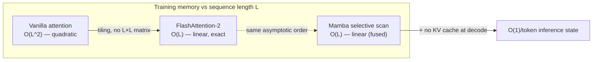
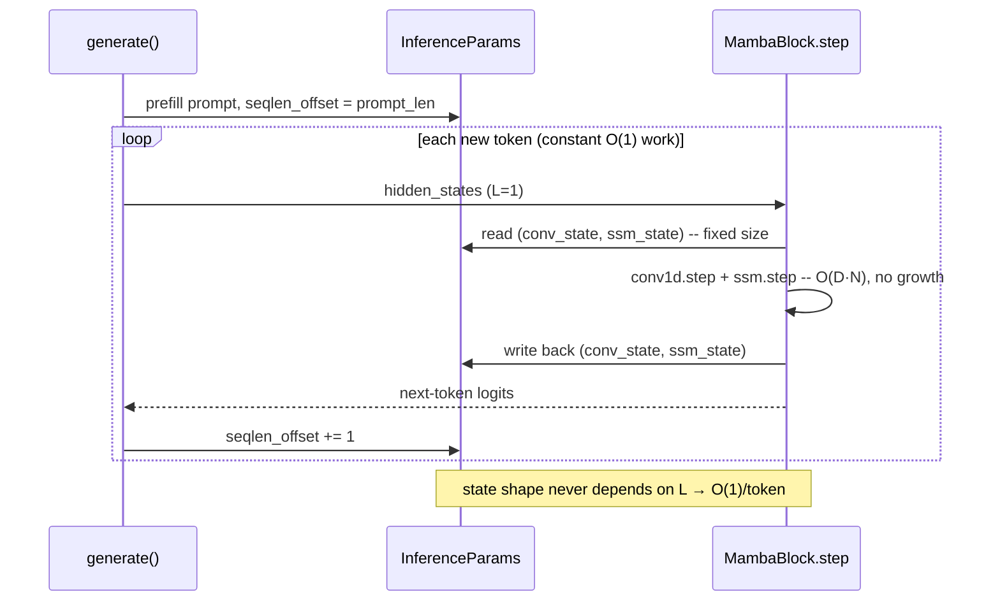

# 08 — Benchmarks and Comparisons

## Overview

This document explains how to *reason about* and *measure* the performance of
the from-scratch Mamba in this repository, and how it compares to the two
architectures it is usually measured against: the Transformer
[Vaswani et al., 2017] and the structured state space model S4
[Gu et al., 2021]. The selective-SSM design itself is from
[Gu & Dao, 2023], and the attention baseline most relevant for memory
comparisons is FlashAttention-2 [Dao, 2023].

There are two very different kinds of statement you can make about performance,
and this doc keeps them strictly separated:

1. **Asymptotic complexity** — provable, hardware-independent statements about how
   cost grows with `L`, `B`, width `D`, and state size `N`. Exact; the backbone
   of this document.
2. **Wall-clock / memory measurements** — hardware-, kernel-, and
   precision-dependent. Trustworthy only when *you* produce them on *your* machine
   with the methodology below.

> **Honesty note.** This repository is a pedagogical, pure-PyTorch
> implementation. It has **not** been run through a large multi-GPU benchmark
> suite, so this document deliberately contains **no fabricated "our measured
> results."** Every concrete number is either (a) an asymptotic expression,
> (b) clearly labelled *illustrative*, or (c) attributed to a published source
> with an `[Author et al., Year]` citation. Where you see a table of timings or
> perplexities, treat it as a *template to fill in* or a *cited external
> result*, never as a measurement taken here.

A second caveat specific to this codebase: the parallel scan in
`mamba/ops/selective_scan_parallel.py` is a *teaching* implementation — a
Hillis–Steele log-depth scan built from `mul`/`add`/`cat` so ordinary autograd
gives exact gradients, at the cost of an extra `log L` factor in *work* and
materializing the full state tensor. The asymptotics quoted for "Mamba" in the
complexity table refer to the **fused-kernel** design from [Gu & Dao, 2023];
*our* implementation's asymptotics are called out separately where they differ.

---

## Mathematical Background (Complexity)

### Notation

| Symbol | Meaning | Where it lives in the code |
| ------ | ------- | -------------------------- |
| `B` | batch size | first input dim everywhere |
| `L` | sequence length | second input dim |
| `D` | model width (`d_model`) | `MambaConfig.d_model` |
| `E` | inner expansion (`expand`) | `MambaConfig.expand` (default 2) |
| `d` | inner width `= E·D` (`d_inner`) | derived in `mamba/config.py` |
| `N` | SSM state size (`d_state`) | `MambaConfig.d_state` (default 16) |
| `H` | number of attention heads (Transformer only) | n/a here |

For a self-attention layer the dominant terms are the `L×L` attention score
matrix and the position-wise feed-forward network. For an SSM layer the dominant
term is the scan over `L` steps, each touching a state of size `d·N`.

### Theoretical complexity table

The table below is **asymptotic and exact**. It compares one layer (plus its
mixing/FFN, where applicable) over a sequence of length `L`.

| Quantity | Transformer (vanilla attn) | S4 (LTI SSM) | Mamba (selective SSM) |
| -------------------------------- | -------------------------------- | ------------------------ | ----------------------------- |
| Training FLOPs (per sequence) | `O(L² · D + L · D²)` | `O(L log L · D + L·D·N)` | `O(L · D · N)` |
| Sequence-length scaling | **quadratic** in `L` | **quasi-linear** `L log L` | **linear** in `L` |
| Training peak memory | `O(L²)` vanilla / `O(L)` FlashAttn | `O(L)` | `O(L)` (fused kernel) |
| Autoregressive step — time | `O(L · D)` | `O(D · N)` = `O(1)` in `L` | `O(D · N)` = `O(1)` in `L` |
| Autoregressive step — memory | `O(L · D)` (KV cache grows) | `O(D · N)` = `O(1)` in `L` | `O(D · N)` = `O(1)` in `L` |
| State carried across steps | growing KV cache | fixed `O(D·N)` | fixed `O(D·N)` |

The training-FLOP rows in math form:

```math
\text{Transformer} : \quad \Theta\!\big(L^2 D + L D^2\big)
```

Self-attention computes an `L×L` score matrix for each of `D`-wide
representations, so the attention term grows with the **square** of the sequence
length; the `L D²` term is the projections/FFN. For long `L` the `L²` term
dominates.

```math
\text{S4 (LTI)} : \quad \Theta\!\big(L \log L \cdot D\big)
```

S4 is *linear time-invariant*: its recurrence has no input-dependent gates, so
the whole layer is a long convolution that can be evaluated with an FFT in
`L log L` time [Gu et al., 2021]. Quasi-linear, but the constant from the FFT and
the loss of selectivity matter in practice.

```math
\text{Mamba (selective)} : \quad \Theta\!\big(B \, L \, D \, N\big)
```

Mamba's parameters (`Δ`, `B`, `C`) are *input-dependent*, so it is **not**
LTI and cannot be turned into a single fixed convolution. Instead it is computed
as a **selective scan**: a first-order linear recurrence
`h_t = Ā_t ⊙ h_{t-1} + B̄_t u_t` (see `mamba/ops/_scan_common.py`). A
work-efficient parallel scan evaluates this in `O(L)` *work* and `O(log L)`
*depth*, so total training cost is **linear in `L`** — the headline result of
[Gu & Dao, 2023].

#### Asymptotics of *this* repository's scan

`mamba/ops/selective_scan_naive.py` is the sequential reference:

```math
\text{naive scan} : \quad O(L)\ \text{sequential steps}, \qquad
\text{state memory } O(B \, D \, N)
```

It loops over `L`, keeping only the running state `(B, d, N)` — never the full
spacetime tensor — matching the fused kernel's memory but giving up parallelism.

`mamba/ops/selective_scan_parallel.py` (`_parallel_prefix_scan`, Hillis–Steele):

```math
\text{parallel scan} : \quad O(\log L)\ \text{depth}, \quad O(L \log L)\ \text{work},
\qquad \text{memory } O(B \, L \, D \, N)
```

The docstring of `selective_scan_parallel` is explicit about this: it
"materializes the full `(batch, L, d_inner, d_state)` state, giving `O(B L D N)`
memory — the price of a pure-PyTorch parallel scan. A fused CUDA kernel (or
`torch.utils.checkpoint`) is required to reach the `O(B D N)` memory of the
reference loop." So our parallel scan trades the textbook `O(L)` work for an easy
`log L`-deeper autograd-friendly version, and trades constant state memory for
linear-in-`L` activation memory. The *asymptotic class versus the Transformer*
(linear vs quadratic in `L`) is preserved either way.

---

## Implementation Notes (how to benchmark)

### Wall-clock benchmark setup

The micro-benchmarks live in
`tests/benchmark/bench_selective_scan.py`. They use `pytest-benchmark` and are
tagged `slow` so they are excluded from the default CI run. To execute them:

```bash
pytest tests/benchmark/ -m slow --benchmark-only
```

What the harness actually does (read the file — these are real names):

- `_inputs(length, batch=1, d_inner=16, d_state=8)` builds a fresh, seeded
  (`torch.manual_seed(0)`) set of `u, delta, A, B, C, D` tensors on
  `_DEVICE = cuda if available else cpu`.
- `test_bench_naive_scan` and `test_bench_parallel_scan` time
  `selective_scan_naive` vs `selective_scan_parallel` at `L = 2048`, in the same
  `benchmark(...)` group `"scan"` so `pytest-benchmark` prints them side by side.
- `test_bench_scan_vs_seqlen` is `@pytest.mark.parametrize`-d over
  `seqlen ∈ {128, 512, 2048, 8192}` and times the parallel scan as `L` grows.
- **Every** timed closure ends with `torch.cuda.synchronize()` when on CUDA, so
  the wall-clock includes the asynchronous kernel work and not just launch time.

**Methodology to extend it to the full 128 → 131072 sweep.** The prompt's target
range is `L ∈ {2^7, …, 2^17} = {128, 256, …, 131072}`. To benchmark that
honestly:

1. **Widen the sweep.** Change the `parametrize` list in
   `test_bench_scan_vs_seqlen` to the full power-of-two range
   `[128, 256, 512, 1024, 2048, 4096, 8192, 16384, 32768, 65536, 131072]`.
2. **Control what varies.** Hold `batch`, `d_inner`, `d_state`, dtype, and device
   fixed; vary only `L`. Keep the seed fixed (already done) so input statistics
   are identical across runs.
3. **Pick realistic widths.** The defaults (`d_inner=16, d_state=8`) are tiny —
   good for unit-test speed, useless for representative timing. Use real model
   widths, e.g. the 125M config's `d_model=768, expand=2 → d_inner=1536`,
   `d_state=16`.
4. **Report what `pytest-benchmark` gives you**: min / median / mean / stddev /
   IQR over many rounds. Prefer **median** for wall-clock (robust to OS jitter).
5. **Record the environment** — GPU model + VRAM, CUDA/cuDNN/PyTorch versions,
   driver, and dtype — or the number is meaningless.
6. **Expect a crossover, not a constant gap.** At small `L` the naive sequential
   loop can win (no `log L` overhead); the parallel scan pulls ahead as `L` grows
   and depth `O(log L)` beats `O(L)` — *on a GPU*. On CPU its extra work often
   makes it slower; document the device.

> Environment grid to fill in yourself (**no numbers asserted here**): GPU
> (e.g. A100 80GB / RTX 4090 / CPU-only), dtype (fp32 / bf16 / fp16), batch `B`,
> width `d_inner` (1536 @125M … 4096 @1.3B), `d_state` `N`=16, `L` sweep
> 128…131072, metric = median ms/iter and peak MiB.

### Memory usage curves

The decisive long-context advantage is **memory**, and it is an asymptotic
statement, not a benchmark:

```math
\text{vanilla attention memory} = \Theta(L^2), \qquad
\text{FlashAttention-2 memory} = \Theta(L), \qquad
\text{Mamba memory} = \Theta(L)
```

Vanilla attention materializes the `L×L` score matrix, so doubling `L`
quadruples memory. FlashAttention-2 [Dao, 2023] tiles the attention computation
and **never materializes** that matrix, recovering linear `O(L)` memory while
remaining exact. Mamba is linear in `L` by construction (a fused selective scan
keeps only the `O(B·D·N)` recurrent state plus `O(B·L·D)` activations).

So **at the asymptotic level Mamba and FlashAttention-2 are *both* linear in
`L`.** The honest framing is: Mamba's win over attention is largest against
*vanilla* (quadratic) attention; against FlashAttention-2 the memory curves are
the *same order* and the real differences are (a) the constant factors, (b) that
Mamba needs no KV cache at inference, and (c) inference-time step cost (next
section). Be skeptical of plots that show Mamba beating FlashAttention-2 by an
order of magnitude in *training* memory — check whether the baseline is vanilla
attention.

A conceptual picture of the three regimes:



*(Illustrative orders only; the diagram encodes asymptotic classes, not measured
megabytes.)* Recall that *our* parallel scan materializes `O(B·L·D·N)` (steeper
slope than the fused kernel) — wrap it in `torch.utils.checkpoint` or fall back to
the naive `O(B·D·N)` scan if you are memory-bound while studying long `L`.

To **measure** memory honestly on CUDA, bracket a forward (and, for training,
backward) with:

```python
torch.cuda.reset_peak_memory_stats()
# ... forward / backward ...
torch.cuda.synchronize()
peak = torch.cuda.max_memory_allocated()
```

Plot `peak` vs `L` on log-log axes; the slope is the exponent (≈ 1 linear, ≈ 2
quadratic).

### Throughput (tokens/sec)

Throughput is the headline metric for model sizes from 125M to 1.3B parameters —
the standard scaling-law suite used in [Gu & Dao, 2023] (aligned to the
GPT-3 / Pythia size points: ~125M, 350M, 760M, 1.3B).

**How to measure (training throughput).** For each model size: build the model
from a `MambaConfig` sized to the target parameter count (print
`sum(p.numel() for p in model.parameters())`, as `examples/train_lm.py` does);
run `K` warmup steps (forward+backward+optimizer) and discard them; time `M`
measured steps with `torch.cuda.synchronize()` before and after; then
`tokens/sec = (B · L · M) / elapsed_seconds`.

**How to measure (inference throughput).** Use the recurrent path in
`mamba/utils/generation.py`: call `generate(model, input_ids, max_new_tokens=…)`
and compute `tokens/sec = generated_tokens / elapsed`, **separating prefill from
decode** — prefill is one parallel pass over the prompt; decode is a loop of
single-token `O(1)` steps (see [Latency](#latency-comparison)).

> **Illustrative / cited figures (do not treat as measured here).**
> [Gu & Dao, 2023] report that Mamba achieves roughly **5×** the
> *generation* throughput of a similarly sized Transformer, because it has no
> growing KV cache to read each step, and that its quality matches Transformers
> about **twice** its size on several benchmarks. The exact tokens/sec depend
> entirely on GPU, batch size, dtype, and kernel — fill the table below from
> your own runs:
>
> | Params | Train tok/s (fill in) | Decode tok/s (fill in) | Source |
> | ------ | --------------------- | ---------------------- | ------ |
> | 125M | _your run_ | _your run_ | this repo (methodology above) |
> | 350M | _your run_ | _your run_ | this repo |
> | 760M | _your run_ | _your run_ | this repo |
> | 1.3B | _your run_ | _your run_ | this repo |
>
> Published ratio: Mamba decode ≈5× a same-size Transformer [Gu & Dao, 2023].

### Quality comparison

Speed only matters at matched quality. The standard comparison is
**language-modeling perplexity at a matched parameter (or compute) budget** on a
corpus such as The Pile.

> **Illustrative table — cited, not measured here.** [Gu & Dao, 2023] show
> Mamba matching or beating strong Transformer recipes (e.g. Transformer++)
> at equal parameters, and following the same compute-optimal scaling laws. The
> shape of the result (lower perplexity at equal params, or equal perplexity at
> ~half the params) is the claim to remember; do not quote specific decimals
> from memory.
>
> | Model (≈ params) | Pile perplexity ↓ | Note |
> | ---------------- | ----------------- | ---- |
> | Transformer++ baseline | _see paper_ | [Gu & Dao, 2023] |
> | S4 / H3 family | _see paper_ | [Gu et al., 2021] |
> | Mamba (equal params) | _see paper, ≤ baseline_ | [Gu & Dao, 2023] |

To reproduce a *small-scale* quality signal **in this repo**, train on a real
tokenized corpus by replacing `synthetic_batch` in `examples/train_lm.py` and
report validation perplexity = `exp(cross_entropy)` (the loop already prints
`torch.exp(loss)`); match parameter counts and token budgets before comparing.

### Long-context performance

Beyond perplexity, SSMs are evaluated on **synthetic tasks** that isolate
*selective recall* — the ability to remember the right token over a long gap and
ignore distractors:

- **Selective Copying** — copy a marked subsequence, ignoring random filler.
  Exactly what the *selection* mechanism (input-dependent `Δ, B, C`) was designed
  for; LTI models like S4 struggle because they cannot decide *what* to remember
  [Gu & Dao, 2023].
- **Induction Heads** — predict the token that followed the last occurrence of
  the current token; tests in-context retrieval and **length extrapolation**
  (train short, test much longer).
- **Synthetic retrieval / "needle in a haystack"** — retrieve a value stored far
  earlier in the context.

**What this repo ships.** `examples/train_lm.py` includes a deliberately simple
**copy task**: `synthetic_batch` returns `[prefix, prefix]` sequences
(`torch.cat([prefix, prefix], dim=1)`), so the model must reproduce the first
half from the second half. Watching its loss/perplexity fall is a minimal,
runnable demonstration of recall — a stepping stone toward the harder Selective
Copying / Induction Heads tasks above, not a substitute for them. To turn it
into a *selective* recall probe, insert random distractor tokens between the
prefix and its copy and verify the model still reconstructs the prefix.

The architecturally important point: because decode state is fixed-size (next
section), evaluating at a longer test length than training costs **no extra
per-step memory** — which is what makes length-extrapolation practical.

### Latency comparison

This is Mamba's clearest, most defensible advantage, and it is asymptotic.

```math
\text{Transformer decode step} = O(L), \qquad \text{Mamba decode step} = O(1)
```

A KV-cache Transformer must, for token `t`, attend over all `t` cached
keys/values — so the per-step cost **grows linearly** with how much has already
been generated, and the cache memory grows with it too. Mamba carries a
**fixed-size recurrent state** and updates it in constant time and memory **per
token, regardless of position**.

This is implemented directly in this codebase:

- `InferenceParams` (`mamba/utils/generation.py`) holds, per layer, a
  `(conv_state, ssm_state)` pair in `key_value_memory_dict` — both shaped
  *independently of sequence length*. The module docstring states it plainly:
  decoding is "`O(1)` time and memory per token regardless of how much text has
  already been produced."
- `generate(...)` does a single **prefill** pass over the prompt
  (`inference_params.seqlen_offset = prompt_len`), then loops emitting one token
  at a time, advancing `seqlen_offset += 1` each step.
- The per-token work routes through `MambaBlock.step(...)`
  (`mamba/layers/mamba_block.py`): `conv1d.step` rolls the
  `(B, d_inner, d_conv)` conv buffer and `ssm.step` updates the `(B, d_inner,
  d_state)` SSM state — both constant size. Selection of this path is gated on
  `inference_params.seqlen_offset > 0` (one token, `L == 1`).



**How to measure latency.** Time the decode loop only (exclude prefill). For a
KV-cache Transformer baseline, time-per-step will trend upward with position;
for Mamba it should be **flat**. Plot per-step latency vs token index — a flat
line vs a rising line is the whole story. Always `torch.cuda.synchronize()`
around each timed region.

---

## Common Pitfalls (benchmarking gotchas)

These mistakes will silently corrupt every number you produce:

1. **No warmup.** The first call pays for CUDA context creation, lazy kernel
   compilation/autotuning, and cuDNN algorithm selection. Always run several
   untimed warmup iterations and discard them before timing.
2. **Forgetting `torch.cuda.synchronize()`.** CUDA kernels are *asynchronous*:
   Python returns before the GPU finishes. Without a sync before stopping the
   clock you are timing *launch overhead*, not compute. The harness in
   `tests/benchmark/bench_selective_scan.py` syncs inside every timed closure —
   mirror that in any new benchmark.
3. **Confusing prefill with decode.** Prefill processes the whole prompt in one
   parallel pass; decode is the `O(1)`/token loop. Reporting "tokens/sec" without
   saying which one (or blending them) is meaningless. Separate them.
4. **Floating-point precision drift.** fp16/bf16 are much faster but accumulate
   error; the selective scan involves long products of `Ā_t`, which is precisely
   where low precision bites. Validate correctness in fp32 against
   `selective_scan_naive` (the repo's `tests/property` checks this and
   `gradcheck` runs in fp64) **before** trusting speed numbers taken in reduced
   precision. Report the dtype with every measurement.
5. **Toy widths.** The benchmark defaults (`d_inner=16, d_state=8`) exist for
   fast unit tests. They are memory-bandwidth-bound trivia, not representative of
   a real model — use production widths for any quoted throughput.
6. **CPU vs GPU mix-ups.** The parallel scan's `O(L log L)` *work* can make it
   slower than the `O(L)` naive loop on CPU even though it wins on GPU (where its
   `O(log L)` depth is what matters). The device is part of the result.
7. **Comparing against the wrong attention baseline.** "Mamba uses far less
   memory than attention" is dramatically true against *vanilla* `O(L²)`
   attention and much milder against FlashAttention-2 `O(L)` [Dao, 2023]. State
   your baseline. And use **medians over many rounds** (pytest-benchmark does
   this for you); a single run is noise, not a measurement.

---

## References

- **[Vaswani et al., 2017]** Vaswani, A., Shazeer, N., Parmar, N., et al.
  *Attention Is All You Need.* NeurIPS 2017. (Transformer; `O(L²)` self-attention.)
- **[Gu et al., 2021]** Gu, A., Goel, K., Ré, C. *Efficiently Modeling Long
  Sequences with Structured State Spaces (S4).* ICLR 2022 (arXiv 2021).
  (LTI SSM; FFT-based `O(L log L)` training.)
- **[Dao, 2023]** Dao, T. *FlashAttention-2: Faster Attention with Better
  Parallelism and Work Partitioning.* 2023. (Exact attention with `O(L)` memory.)
- **[Gu & Dao, 2023]** Gu, A., Dao, T. *Mamba: Linear-Time Sequence Modeling
  with Selective State Spaces.* 2023. (Selective SSM; linear-time training,
  `O(1)`/step decode; throughput and quality claims cited above.)
- **[Blelloch, 1990]** Blelloch, G. *Prefix Sums and Their Applications.*
  (Work-efficient parallel scan; basis of `selective_scan_parallel.py`.)

### Source files referenced in this document

- `tests/benchmark/bench_selective_scan.py` — scan micro-benchmarks.
- `mamba/ops/selective_scan_parallel.py` — log-depth scan (`O(L log L)` work,
  `O(B·L·D·N)` memory); `selective_scan_naive.py` — sequential reference (`O(L)`
  steps, `O(B·D·N)` state); `_scan_common.py` — shared discretization.
- `mamba/utils/generation.py` — `InferenceParams`, `generate` (constant-memory
  decode); `mamba/layers/mamba_block.py` — `MambaBlock.step` (per-token path).
- `mamba/config.py` — `MambaConfig` (sizing); `examples/train_lm.py` — synthetic
  copy-task training example.
